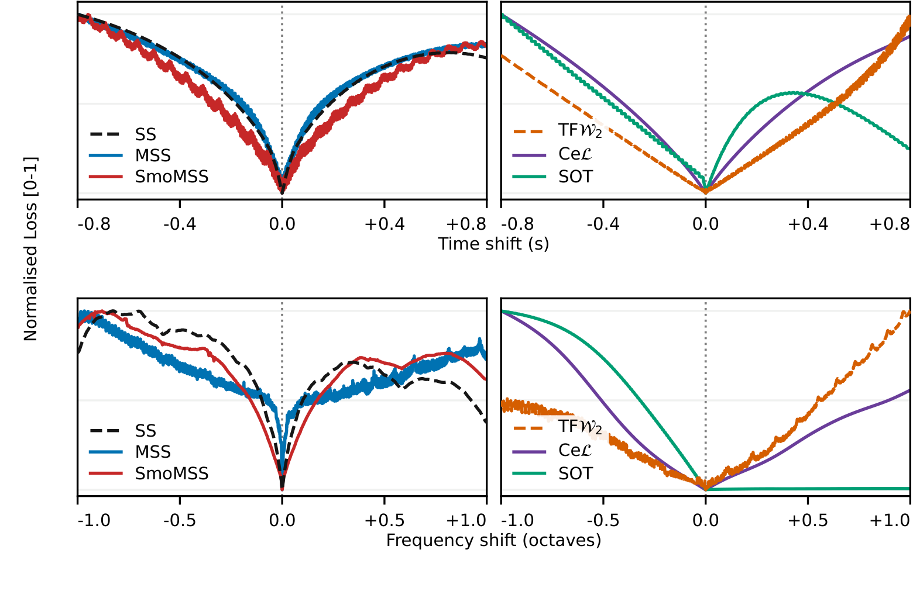

# Unsupervised Estimation of Plucked String Musical Phrase Parameters via Differentiable DSP and Cumulative Energy Losses

Differentiable digital signal processing commonly predicts controls as either a
constant set of parameters or dense frame trajectories. Plucked-string musical
phrases are more naturally represented as discrete events, each with a pitch
($f_0$) and onset time. However, optimising these parameters displaces energy in
frequency and time: waveform and pointwise spectral losses are prone to
oscillatory local minima and provide little directional guidance when energy
does not overlap. We propose Cumulative Energy Losses (CeLs), which compare
accumulated spectral power to support unsupervised joint estimation of pitch
and timing.



*Single-pluck loss slices around a 160-Hz, 1-s target. Top: time shift with pitch
fixed; bottom: frequency shift with onset fixed. Each curve is independently
normalised to [0, 1].*

Code and numerical results accompanying the paper by Pablo Tablas de Paula,
Sebastian J. Schlecht, Emmanouil Benetos and Joshua D. Reiss (submitted to ICASSP 2027).

This repository reproduces the paper's 16-kHz experiments. The independent
[CeLs library](https://github.com/ptablasdpaula/ICASSP27-Phrase/tree/cel-library)
is installed from PyPI, pinned to `cels-audio==0.1.1`. Spectral and transport baselines,
synthesis, evaluation and experiment runners belong to this paper repository.
The original submission checkout is tagged `paper-submitted-2026-09-24`;
the cleaned reproduction release is `paper-reproduction-v0.2.2`.

## Installation

The locked environment targets Linux, Python 3.12, PyTorch 2.7.1/CUDA 12.6,
FLAMO 0.2.18 and the recorded PhilTorch/TorchLPC commits.

```bash
git clone https://github.com/ptablasdpaula/ICASSP27-Phrase.git
cd ICASSP27-Phrase
pixi install --locked
pixi run install-cpu-backends
pixi run check
```

Plotting saved results needs no GPU
or compiled synthesis backend. To compute on CUDA, run
`pixi run install-backends` on a GPU node with a CUDA 12.6 toolkit and `nvcc`.
The default build supports V100/A100 architectures; use `TORCH_CUDA_ARCH_LIST`
for other compatible GPUs. The installer preserves the pinned backend commits.

Without Pixi, create a Python 3.12 environment, install the appropriate
PyTorch 2.7.1 CPU or CUDA 12.6 wheel, then:

```bash
pip install -e '.[notebook]'
ICASSP27_BACKEND_DEVICE=cpu bash scripts/install_backends.sh
python scripts/check.py
```

The Pixi lockfile is the reference environment; other platforms are not qualified.

## Quick examples

[](https://molab.marimo.io/github/ptablasdpaula/ICASSP27-Phrase/blob/main/notebooks/optimize_phrase.py)

Open the notebook preview above, then use Molab to run it in a cloud Python
session. Running requires a Molab account; the first launch installs the pinned
CPU dependencies and can take several minutes. For a local session, use
`pixi run notebook`.

```python
import torch
from icassp27_phrase import PhraseSynth, load_target, fit

synth = PhraseSynth().to("cpu")
metadata, phrase = load_target(2, 1)
with torch.no_grad():
    target = synth.render(phrase)
result = fit(target, cardinality=2, loss_name="CeL", synth=synth)
print(result.best_phrase)
```

`pixi run notebook` opens the interactive single-phrase demo. It uses the same
loss implementations and optimiser as the batch recovery experiment. **Run optimisation**
starts the fit directly, with an iteration counter updated every step and a
spectrogram refreshed every 10 Adam updates. Each fit
starts at 160 Hz with evenly spaced onsets; larger CPU fits can take considerable
time. The notebook reports the lowest-loss candidate, without rollback or
resetting Adam state. `pixi run notebook-check` validates the notebook structure.

## Rebuild the figures and tables

The compact reference data are tracked under `paper/results/`, including the
6,750 recovered phrases and their metrics. No audio, checkpoints or full GPU
trajectories are needed to regenerate the paper's presentation.

```bash
pixi run check --data-only
pixi run figures
pixi run tables
pixi run paper
```

Generated figures and tables go to `results/figures/` and `results/tables/`.
The paper build uses its checked-in submission assets. To explicitly replace
those assets, supply `--output paper/figures` to the figure/table command.
The waveguide diagram is a retained static PDF; the other figures have generators.
The efficiency table is also emitted as `efficiency_table.tex`, while its
submitted values remain inline in the manuscript.

## Recompute the experiments

All commands accept `--help`. Scientific defaults are versioned in code;
paths and cluster resources are configured separately. Local CPU execution is
available for gradient analysis and recovery, but full campaigns should use GPUs.

| Command | Output and scope |
|---|---|
| `pixi run targets` | Regenerate the frozen 150-target LHS registry for each note count |
| `pixi run gradients all` | Main gradient conditions plus State and 7-D; 224 target jobs |
| `pixi run recovery` | Nine objectives × five note counts × 150 independent fits |
| `pixi run report-recovery` | Recompute matched errors, LSD and the Random baseline from completed fits |
| `pixi run slices` | Compute the six single-pluck loss slices |
| `pixi run efficiency --output results/efficiency/all.json` | Five fixed-candidate objectives on one GPU model |

Use `--device cpu` where supported, or `--task INDEX` to run one gradient/recovery
job. For gradients, run `pixi run gradients qualify` before separate `compute`
jobs, and `pixi run gradients report` after they complete. Targets use the frozen
seeds and retain the 50-ms separation; candidates have no spacing constraint.
Recovery uses independent bounded pitch/onset logits and independent Adam and
plateau state for each phrase. Completed compatible shards are reused; conflicting
source signatures are rejected. An interrupted unfinished shard restarts from
its deterministic initialisation.

The saved recovery campaign consumed approximately 93 GPU-hours for the original
nine-objective campaign (including MSS, which was later excluded), plus the SOT
control campaign. This is a historical measurement, not a runtime guarantee.
The fixed-candidate efficiency benchmark uses 150 one-note targets in batches
of 10, five warm-up and 20 measured passes, with no optimiser updates. The
published measurements used an A100 40 GB; do not mix GPU models within a table.

To plot a newly completed campaign instead of the reference results, use
`pixi run figures --data results` and `pixi run tables --data results` after all
required computations and reports have completed. The resulting directory
structure mirrors the reference data. Full reruns can differ numerically across
hardware/toolchains; timing results are hardware-specific.

## Paths and Slurm

Copy `.env.example` to `.env` if you want different output, cache or log
locations. Relative paths are interpreted from the checkout. Command-line
options override environment variables, which override `.env`, then defaults.
No personal home or scratch paths are required. Keep large generated results
outside the checkout if desired; `paper/results/` remains the reference archive.
From another directory, use `pixi run --manifest-path /path/to/pixi.toml …`,
or invoke an installed environment's Python on an absolute script path.

`jobs/profiles.toml` contains a generic profile and examples for gpushort and
andrena. Adjust partitions, accounts, memory, walltime and concurrency for your
cluster. Submission prints a dry run unless `--submit` is specified:

```bash
pixi run submit recovery --profile gpushort --array 0-3
pixi run submit recovery --profile gpushort --array 0-3 --submit
```

Submit gradient `qualify` first and wait for successful completion before the
`gradients` array. Arrays use the same local commands and output directories.
Partition/account/concurrency overrides are available on the command line.
When using several profiles concurrently, choose non-overlapping task subsets
and respect your allocation's total GPU limit. Efficiency jobs request the
published A100 40-GB model explicitly.

## Repository layout

- `src/synth/`: excitation, Thiran waveguide, phrase rendering and seven-control synthesis.
- `src/data/`: frozen targets and reproducible LHS designs.
- `src/losses.py` and `src/metrics.py`: optimisation losses and separate evaluation metrics.
- `src/optimization.py`: optimiser shared by the notebook and batch runner.
- `scripts/`: current experiments, reporting, presentation and the small check command.
- `jobs/`: one Slurm runner, dispatcher and configurable submission profiles.
- `paper/`: manuscript, referenced assets and compact numerical results.

The check command covers data integrity, sampling, matching, synthesis and loss
gradients, persistent state, seven controls and a short recovery. It replaces
the former exploratory test suite. The independent CeLs library maintains its own checks. Historical experiments remain accessible through Git history;
removing them from the current checkout does not rewrite that history.

## Licence

Original software is [MIT licensed](LICENSE);
third-party code and the CeLs library retain their own notices. The manuscript,
figures and IEEE template files are not relicensed by the software licence.

## Cite this paper

If you find this work useful, please cite our paper:

```bibtex
@InProceedings{TablasDePaula:2026:Unsupervised,
  title     = {Unsupervised Estimation of Plucked String Musical Phrase Parameters via Differentiable DSP and Cumulative Energy Losses},
  author    = {Tablas de Paula, Pablo and Schlecht, Sebastian J. and Benetos, Emmanouil and Reiss, Joshua D.},
  booktitle = {In Press.},
  address   = {Online},
  month     = sep,
  year      = {2026}
}
```

<details>
<summary>Personal TODO</summary>

- Reconcile the methodology wording with the archived runs: relative-improvement
  threshold `0.0001` (0.01%, rather than 1%); phrase-recovery batches of 75,
  or 50 for SOT. The efficiency benchmark uses batches of 10 for every loss.

</details>
