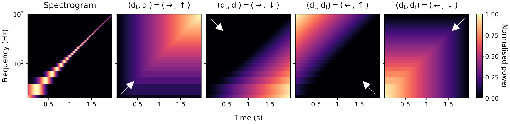

# `cels-audio`

`cels-audio` provides differentiable Cumulative Energy Losses (CeLs) for
PyTorch. A CeL compares energy accumulated over selected directions of a
frequency--time representation, exposing displacement that pointwise losses
cannot measure when candidate and target energy do not overlap.



*Figure 1 from the paper.* A constant-amplitude logarithmic sine sweep rises
from 20 to 1000 Hz over two seconds. The spectrogram is normalised by its peak;
the cumulative surfaces are normalised by total target power. All panels share
a linear 0–1 colour scale. The logarithmic frequency axis is for display only:
accumulation uses linear power on the original STFT grid.

## Installation

Install from PyPI:

```bash
pip install cels-audio
```

The paper's original implementation remains available at the frozen
[`cels-v0.1.0` tag](https://github.com/ptablasdpaula/ICASSP27-Phrase/tree/cels-v0.1.0).

## Waveform Use

```python
import torch
from cels import Direction, STFTCumulativeEnergyLoss

loss = STFTCumulativeEnergyLoss(
    sample_rate=16_000,
    n_fft=1024,
    hop_length=256,
    directions=(Direction.RIGHT_UP, Direction.RIGHT_DOWN),
    log_weighting=True,
)

target = torch.randn(32_000)
candidate = torch.randn(32_000, requires_grad=True)
value = loss(candidate, target)
value.backward()
```

For repeated comparisons with one target, cache its transform and cumulative
surfaces:

```python
bound = loss.bind(target)
value = bound(candidate)
```

## Custom Representations

`CumulativeEnergyLoss` accepts any nonnegative tensor whose final dimensions
are frequency and time. Supply physical coordinates when using logarithmic
frequency weighting or finite decay horizons.

```python
from cels import ALL_DIRECTIONS, CumulativeEnergyLoss

criterion = CumulativeEnergyLoss(
    directions=ALL_DIRECTIONS,
    log_weighting=True,
    time_decay_seconds=1.0,
    frequency_decay_hz=1000.0,
)
value = criterion(candidate_power, target_power, frequency=f_hz, time=t_seconds)
```

The four diagonal directions accumulate over both axes. `up` and `down`
accumulate frequency independently in every frame; `right` and `left`
accumulate time independently in every frequency bin. A loss averages the
RMS discrepancies of every selected direction.

The helper `paper_loss()` returns the frozen CeL, logCeL, decCeL, and tlogCeL
configurations used in the accompanying ICASSP 2027 experiments.

## Mathematical Definitions

### Directional accumulation

For target and candidate waveforms $x$ and $\hat x$, let
$P=|\mathrm{STFT}(x)|^2$ and
$\hat P=|\mathrm{STFT}(\hat x)|^2$ be nonnegative arrays with
$K$ frequency bins and $N$ time frames. The waveform wrapper uses a periodic
Hann window; its default FFT size is 1024 with a 256-sample hop. Custom
representations can be supplied directly instead.

A direction pair $\boldsymbol d=(d_{\mathrm t},d_{\mathrm f})$ selects a
starting corner and the direction in which energy accumulates. Right and up
include indices up to the current bin; left and down include indices from the
current bin to the end. Write $a\preceq_d b$ for $a\leq b$ when
$d\in\{\rightarrow,\uparrow\}$ and $a\geq b$ otherwise. Then

$$
S_{\boldsymbol d}(P)_{k,n}
=\sum_{i\preceq_{d_{\mathrm f}}k}
 \sum_{j\preceq_{d_{\mathrm t}}n}P_{i,j}.
$$

Each value contains the energy in the rectangle from the chosen starting
corner to $(k,n)$, including that bin. The library supports any nonempty
selection of these eight directions:

| `Direction` | Arrows (time, frequency) | Accumulation |
|---|---|---|
| `RIGHT_UP` | $(\rightarrow,\uparrow)$ | From the bottom-left corner |
| `RIGHT_DOWN` | $(\rightarrow,\downarrow)$ | From the top-left corner |
| `LEFT_UP` | $(\leftarrow,\uparrow)$ | From the bottom-right corner |
| `LEFT_DOWN` | $(\leftarrow,\downarrow)$ | From the top-right corner |
| `UP` | $\uparrow$ | Low to high frequency, separately within each frame |
| `DOWN` | $\downarrow$ | High to low frequency, separately within each frame |
| `RIGHT` | $\rightarrow$ | Earlier to later frames, separately within each frequency bin |
| `LEFT` | $\leftarrow$ | Later to earlier frames, separately within each frequency bin |

For an orthogonal direction, only one sum is taken: for example,
$S_{\uparrow}(P)_{k,n}=\sum_{i\leq k}P_{i,n}$ and
$S_{\rightarrow}(P)_{k,n}=\sum_{j\leq n}P_{k,j}$.
There is no accumulation along the other axis. The default is all four diagonals.

### Comparing the surfaces

Let $m=\sum_{k,n}P_{k,n}>0$ be **total target power**. Both inputs use this
same normalisation, so differences in total power remain visible. The library
uses the square-root feature map
$\phi(u)=\sqrt{\max(u,\varepsilon)}$, with $\varepsilon=10^{-12}$ by default:

$$
E_{\boldsymbol d,k,n}
=\phi\!\left(\frac{S_{\boldsymbol d}(\hat P)_{k,n}}{m}\right)
-\phi\!\left(\frac{S_{\boldsymbol d}(P)_{k,n}}{m}\right).
$$

For a selected direction set $\mathcal D$, the loss averages the directional
root-mean-square discrepancies:

$$
\ell_{\boldsymbol d}
=\sqrt{\frac{1}{KN}\sum_{k,n}E_{\boldsymbol d,k,n}^{\,2}},
\qquad
\mathcal L_{\mathcal D}(\hat P,P)
=\frac{1}{|\mathcal D|}\sum_{\boldsymbol d\in\mathcal D}\ell_{\boldsymbol d}.
$$

Inputs have shape `[..., frequency, time]`. Each leading element has its own
target mass; `reduction="mean"` averages the resulting losses, while
`reduction="none"` retains the leading dimensions. Targets are treated as fixed
references, and gradients flow through the candidate.

### Logarithmic weighting and decay

**Logarithmic weighting** (`log_weighting=True`) changes how the surface errors
are integrated; it does not take the logarithm of the input power. With
$q_k=\log_2(\max(f_k,f_{\min})/f_{\min})$, the squared errors are weighted by
frequency–time cell areas $\Delta q_k\Delta t_n$, normalised to sum to one:

$$
\ell_{\boldsymbol d}
=\sqrt{\sum_{k,n}w_{\boldsymbol d,k,n}E_{\boldsymbol d,k,n}^{\,2}},
\qquad \sum_{k,n}w_{\boldsymbol d,k,n}=1.
$$

The cell widths follow the accumulation direction: forward directions use the
next-coordinate gap, reverse directions use the previous-coordinate gap, and
an unscanned axis uses their average. Missing boundary gaps are zero. The default
frequency floor $f_{\min}$ is 20 Hz. Supply frequency coordinates in Hz and time
coordinates in seconds when using a custom representation.

**Decay** makes accumulated energy more local. A contribution loses influence
with distance from its source bin **during accumulation**, rather than being
attenuated once in the input spectrogram. For distance $r\geq0$ and horizon
$h>0$, the implemented weight is

$$
g_h(r)=\max\!\left(0,1-\frac{\log(1+9r/h)}{\log 10}\right).
$$

It is one at the source and zero at or beyond the horizon. For a diagonal
with both horizons enabled, the accumulated surface becomes

$$
S^{\mathrm{dec}}_{\boldsymbol d}(P)_{k,n}
=\sum_{i\preceq_{d_{\mathrm f}}k}\sum_{j\preceq_{d_{\mathrm t}}n}
 g_{h_f}(|f_k-f_i|)\,g_{h_t}(|t_n-t_j|)\,P_{i,j}.
$$

`time_decay_seconds` and `frequency_decay_hz` set the two horizons independently;
`None` means no decay on that axis. Only scanned axes accumulate or decay.
The normalisation remains the original total target power $m$. The paper's
`decCeL` uses 1 second and 1000 Hz, without logarithmic weighting. Decay and
logarithmic weighting can also be combined.

### Relation to Cramér distance

For unit-mass one-dimensional distributions, a single cumulative direction
with the **identity** feature map compares cumulative distribution functions
(CDFs) in $L_2$: the Cramér distance, up to grid-spacing and RMS factors on a
uniform grid. Comparing those CDFs in $L_1$ instead gives the one-dimensional
1-Wasserstein distance. See [Székely and Rizzo (2013)](https://doi.org/10.1016/j.jspi.2013.03.018)
and [Peyré and Cuturi (2019), Remark 2.30](https://doi.org/10.1561/2200000073).
The identity map is a theoretical special case of the paper's family; this
library currently implements the square-root map above. In two dimensions,
the undecayed diagonal surfaces describe quadrant CDFs or cumulative tails
when the corresponding input has unit mass. Axis-only Cramér interpretations
require unit mass within each slice, not just across the entire spectrogram.

If you find this work useful, please cite our paper:

```bibtex
@InProceedings{TablasDePaula:2026:Unsupervised,
  title     = {Unsupervised Estimation of Plucked String Musical Phrase Parameters via Differentiable DSP and Cumulative Energy Losses},
  author    = {Tablas de Paula, Pablo and Schlecht, Sebastian J. and Benetos, Emmanouil and Reiss, Joshua D.},
  booktitle = {In Press.},
  address   = {Online},
  month     = sep,
  year      = {2026}
}
```
