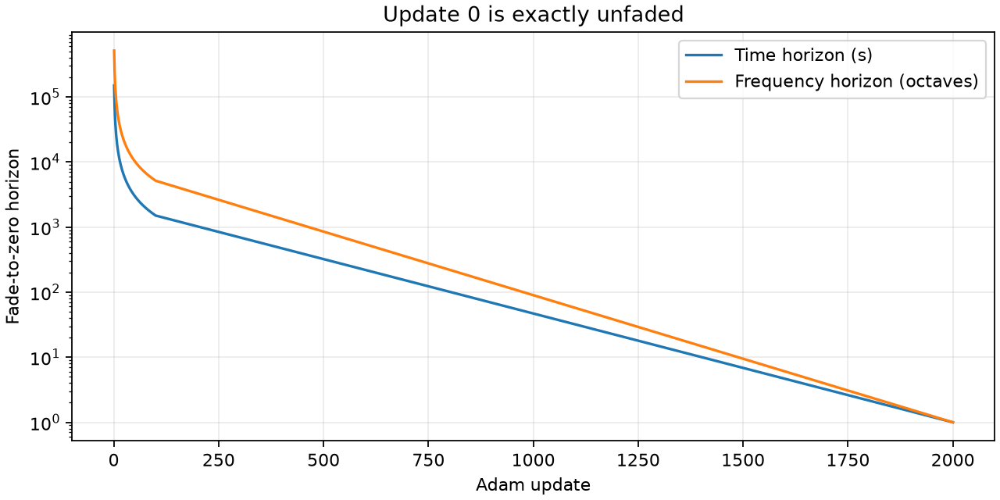
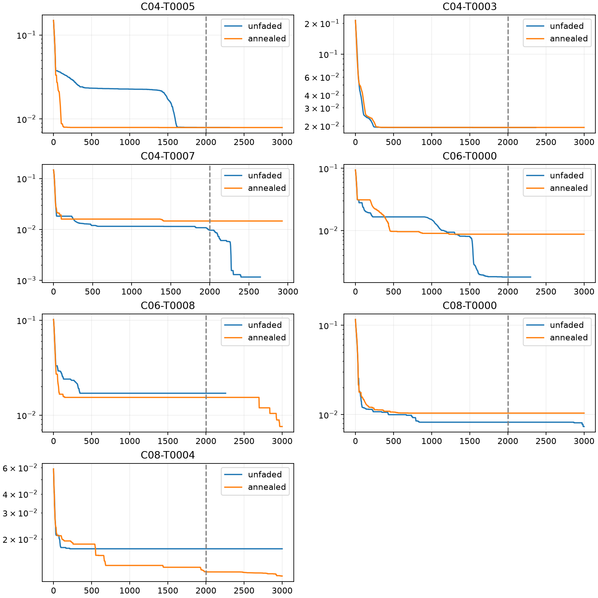

# Gradual fading from a fresh start

Complete: seven phrases × two methods = 14 fresh fits.

[Protocol](protocol.md) · [Per-phrase metrics](per_phrase.csv) · [Statistics](summary.csv) · [Full trajectories](raw-results.json.gz)

Fade horizons change continuously from infinity to 1 second / 1 octave over 2000 updates. Both methods share the schedule and enable patience after update 2000. No saved plateau is used. All amplitudes are fixed, and there is no Log-Weighing.

## Best common-loss checkpoint

Both methods select the strict-best original unfaded diagonal loss across the entire run. Entries are pitch MAE (cents) / onset MAE (ms).

| Case | Unfaded control | Gradual fading |
|---|---:|---:|
| C04-T0005 | 6.227 / 70.012 | 5.981 / 69.471 |
| C04-T0003 | 43.191 / 101.795 | 46.439 / 102.553 |
| C04-T0007 | 12.133 / 2.683 | 496.668 / 171.832 |
| C06-T0000 | 7.308 / 45.614 | 50.712 / 153.652 |
| C06-T0008 | 304.312 / 215.278 | 15.128 / 80.641 |
| C08-T0000 | 86.430 / 43.842 | 87.632 / 98.669 |
| C08-T0004 | 180.933 / 203.400 | 124.995 / 52.562 |

## Actual last iterate

No best-checkpoint selection in this table.

| Case | Unfaded control | Gradual fading |
|---|---:|---:|
| C04-T0005 | 6.447 / 72.937 | 3.891 / 64.675 |
| C04-T0003 | 52.320 / 100.761 | 11.418 / 82.892 |
| C04-T0007 | 7.539 / 3.684 | 108.113 / 295.764 |
| C06-T0000 | 11.337 / 45.785 | 28.376 / 154.785 |
| C06-T0008 | 421.506 / 259.516 | 6.767 / 80.558 |
| C08-T0000 | 90.515 / 53.444 | 115.347 / 97.938 |
| C08-T0004 | 358.399 / 345.376 | 126.034 / 52.285 |

One trajectory per setting on selected failures. The common-loss checkpoint may precede the final fade horizon. Final patience monitors each fixed terminal objective, while the reported checkpoint uses the same unfaded metric for both methods. The controls use this experiment’s schedule, not the earlier registered early-stopping schedule.
