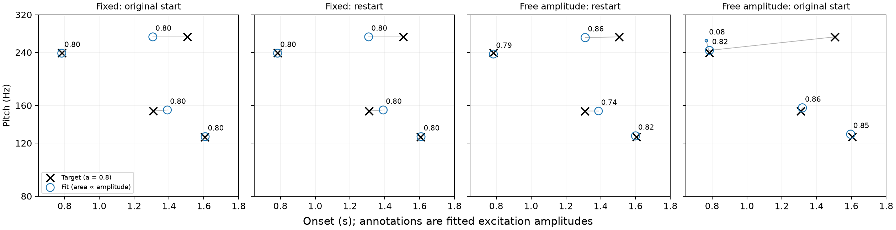
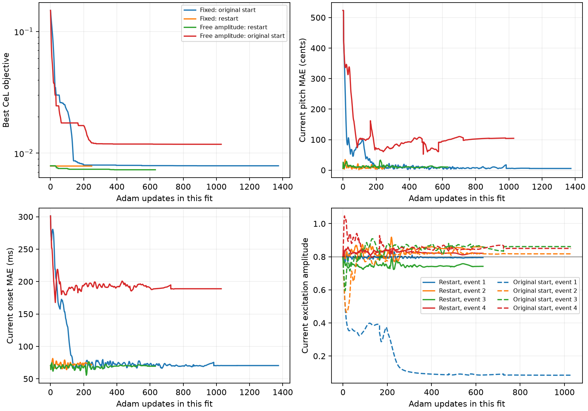

# Four-event excitation-amplitude pilot

Requested 2026-09-16. Hypothesis: optimising excitation amplitudes alongside pitch
and onset may release fits whose pitches are associated with the wrong events.
A competing explanation is that amplitudes merely suppress misplaced events.
This is a selected-case diagnostic, not the 150-target recovery comparison.

## Context from the direction screen

The [direction-screen findings](../cel-gradient-screen/findings.md) and its full
CSV preserve the completed 30-variant experiment. The simultaneous-error results
favour downward-frequency directions for pitch: at four events, the downward
pair gives 72.6% pitch / 65.8% onset alignment, versus 69.2% / 64.6% for all four.
In structured pitch-only slices, the downward pair gives 100%, 99.1%, 98.7%
pitch alignment at four/six/eight events, versus 100%, 96.3%, 92.4% for all four.
Log-Weighing raises the latter to 100%, 99.1%, 98.4%. Timing-only results are mixed:
the downward pair reaches 94.7% at four events; forward-time directions with
Log-Weighing reach 92.4% at eight. These local gradient observations do not
establish convergence. No subset has yet been selected for the full rerun.

## Case selection and protocol

Read-only inspection of the old Fourier-onset pilot found C04-T0005 (UI target 6)
with a clear middle-event pitch swap. Target pitches are approximately
239.20, 153.41, 270.20, 125.76 Hz at 0.7839, 1.3096, 1.5059, 1.6056 s.
The old fit gave 238.53, 270.36, 154.75, 125.93 Hz at
0.7839, 1.3096, 1.3892, 1.6065 s. Historical source:
`/gpfs/scratch/acw794/ICASSP2027-PluckedStringPhrase-v2/simple-dwg-v2-unweighted-fourier-onset-pilot-v1/runs/experiment2/task-00095.json`.
It used different padding, so it is only a case-selection source.

Fresh target audio and all new fits use FFT length 16384 / 8000 samples = 2.048,
the current synthesis path, and unweighted four-direction square-root CeL
(the implementation name is `bidirectional_cumulative_energy`). Target
excitation amplitudes remain 0.8. Four fits use the registered Adam/rollback
schedule, each capped at 3000 updates:

1. Fixed amplitudes, registered equal-cell initialisation.
2. Fixed amplitudes, restart at the fresh baseline's strict-best controls.
3. Trainable amplitudes, same restart controls as 2.
4. Trainable amplitudes, original equal-cell initialisation.

Each restart resets Adam moments and learning rate for both conditions.
Trainable amplitude is positive: `a_i = 0.8 exp(z_i)`, initially `z_i = 0`.
There is no gain penalty or upper bound. The same 0.05 initial learning rate
applies to log-amplitude and the registered bounded pitch/onset logits.
Amplitude scales each event's excitation spectrum before summation and the
waveguide; amplitudes follow the same onset-sort permutation. Target-power
normalisation is unchanged. Resets still occur at every candidate onset.

The isolated fitter copies `src/optimization.py` from 9250d9b and leaves the
production experiment unchanged. Verification compares fixed-amplitude audio,
pitch/onset gradients and three Adam updates exactly with production, and
checks amplitude derivatives by central finite differences at unsorted onsets.
JSON trajectories retain all evaluated controls, amplitudes, objective values
and Hungarian-matched pitch/onset MAEs using the paper's assignment cost.
Report strict-best objective states; a lower loss alone is not recovery.

Run with the project Python (set PYTHONHOME to `.pixi/envs/default`):

```
python scripts/test_amplitude_recovery.py --verify
python scripts/test_amplitude_recovery.py --output docs/amplitude-pilot
```

## Results

All four fits completed on CPU with float64, stopping by the registered patience
rule before the 3000-update cap. No additional cases were fitted or discarded.
The fixed-amplitude baseline reproduces the historical middle-event swap at
2.048 padding. Its 270.21 Hz event occurs at 1.30690 s and its 154.58 Hz event
at 1.39043 s. The target has 153.41 Hz at 1.30964 s followed by 270.20 Hz at
1.50589 s.

| Condition | Updates | Best CeL | Pitch MAE (cents) | Onset MAE (ms) | Amplitudes |
|---|---:|---:|---:|---:|---|
| Fixed: original start | 1374 | 0.0078786668 | 5.481 | 70.452 | 0.800, 0.800, 0.800, 0.800 |
| Fixed: restart | 248 | 0.0078786668 | 5.481 | 70.452 | 0.800, 0.800, 0.800, 0.800 |
| Free amplitude: restart | 632 | 0.0073076684 | 10.212 | 69.671 | 0.794, 0.858, 0.741, 0.823 |
| Free amplitude: original start | 1029 | 0.011833162 | 104.190 | 188.917 | 0.084, 0.818, 0.861, 0.850 |

Errors use the paper's joint Hungarian assignment. A small matched pitch MAE
can conceal the wrong temporal order: the baseline's matched pitch MAE is
5.48 cents, but pairing events chronologically instead gives 488.89 cents.
The latter is an additional diagnostic, not a replacement paper metric.

- A fixed-amplitude restart gives no improvement at the strict-best state.
- The amplitude-enabled restart lowers CeL by **7.25%** but retains the swap.
  Its middle events are 268.71 Hz at 1.31088 s and 153.35 Hz at 1.38737 s.
  Matched onset MAE changes only from 70.45 to 69.67 ms, while matched pitch
  MAE worsens from 5.48 to 10.21 cents. Amplitudes remain 0.741–0.858 at the
  selected state: this modest loss improvement does not involve silencing.
- Learning amplitudes from the original start produces a worse solution,
  with 104.19-cent / 188.92-ms matched errors. One excitation shrinks to
  **0.084**, around 10.5% of the target amplitude. Two candidate events cluster
  near 0.77–0.79 s and the late 270 Hz target is not recovered.

**Interpretation:** per-event amplitude optimisation does not resolve the
pitch–time association failure in this selected case under this parameterisation
and optimiser. It permits both a slightly better wrong configuration and,
from the original start, a weak misplaced excitation. This is evidence against
assuming free amplitude will fix the problem; it is not a general impossibility
result or a comparison of amplitude parameterisations. A constrained or
regularised amplitude variant would be a separate experiment.



Black crosses are targets, blue circles are fits, circle area scales with
excitation amplitude, and annotations give its value. Grey lines show the
paper's joint Hungarian pairing, not persistent event identities.



The objective panel shows the best-so-far loss; error and amplitude panels
show the current evaluated state. Each run's update axis starts from zero.
Amplitude event indices follow the optimiser's persistent parameter slots.

Artifacts: [numerical table](table.md), [additional diagnostics](diagnostics.json),
[provenance](provenance.json), [baseline](baseline.json),
[fixed restart](restart_fixed.json), [amplitude restart](restart_amplitude.json),
[amplitude from original start](initial_amplitude.json). Recreate the plots
with `python scripts/report_amplitude_pilot.py`.

This pilot does not replace the outstanding full recovery rerun at 2.048 padding.

