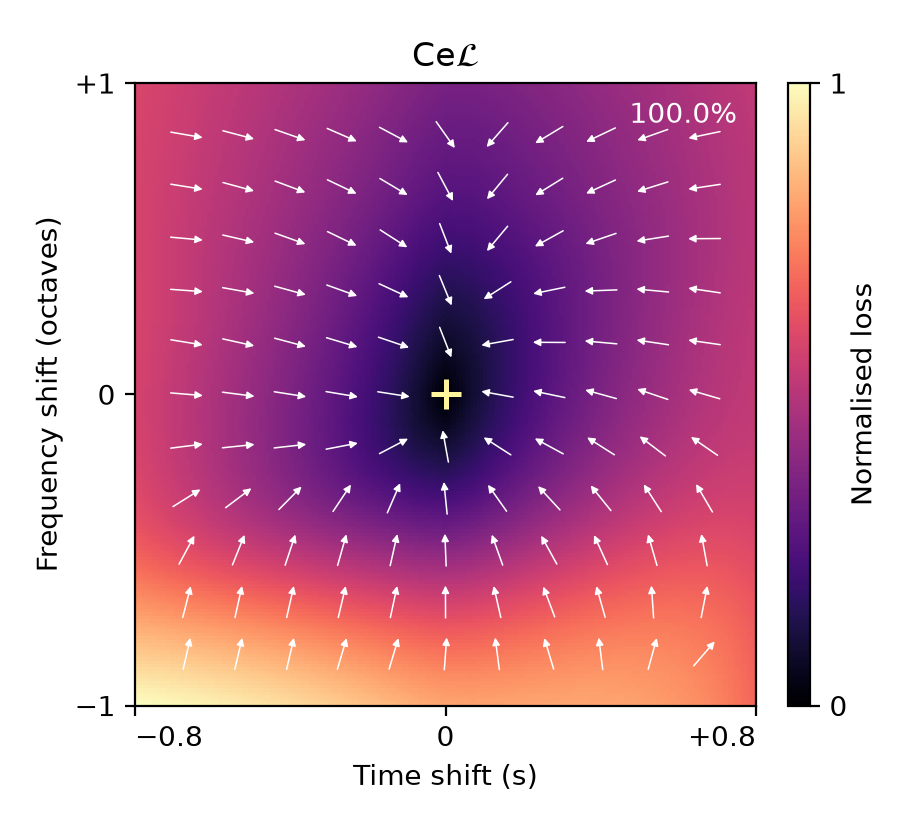

# Single-pluck CeL loss landscape

[PNG](cel-landscape.png) · [PDF](cel-landscape.pdf) · [Provenance](provenance.json)



Standalone four-direction CeL panel extracted from the current single-pluck diagnostic at 2.048 onset padding. The target is 160 Hz at 1.0 s. Candidate onset spans 0.2–1.8 s and pitch spans 80–320 Hz. The heatmap is min–max normalised on the original 25×25 target-inclusive grid and bilinearly interpolated for display, matching the original figure.

The cross marks the target. White arrows show unit negative gradients in normalised pitch/onset coordinates on the original 11×11 interior lattice, excluding the target. All 120 have positive dot product with target displacement (100.0%). This is a single diagnostic case, not a convergence guarantee or a population estimate.

No losses or gradients were recomputed; the existing `paper/figures/loss_landscapes.padding2048.npz` data were reused and their direction count independently checked. The paper figure remains unchanged.

Reproduce with:

```bash
PYTHONHOME="$PWD/.pixi/envs/default" OPENBLAS_NUM_THREADS=1 \
  .pixi/envs/default/bin/python scripts/render_cel_landscape.py
```
