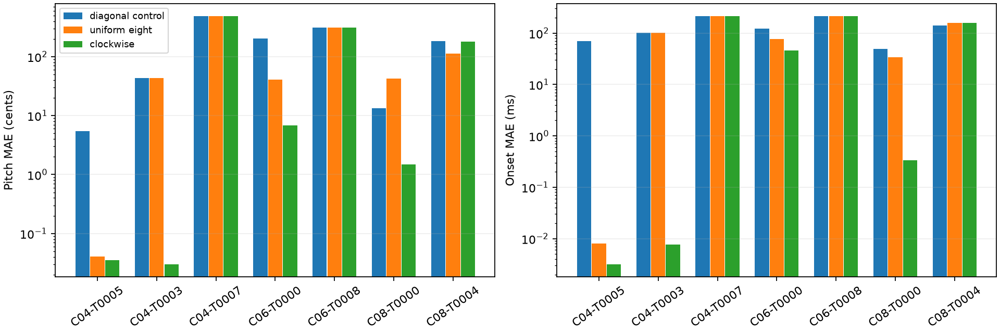
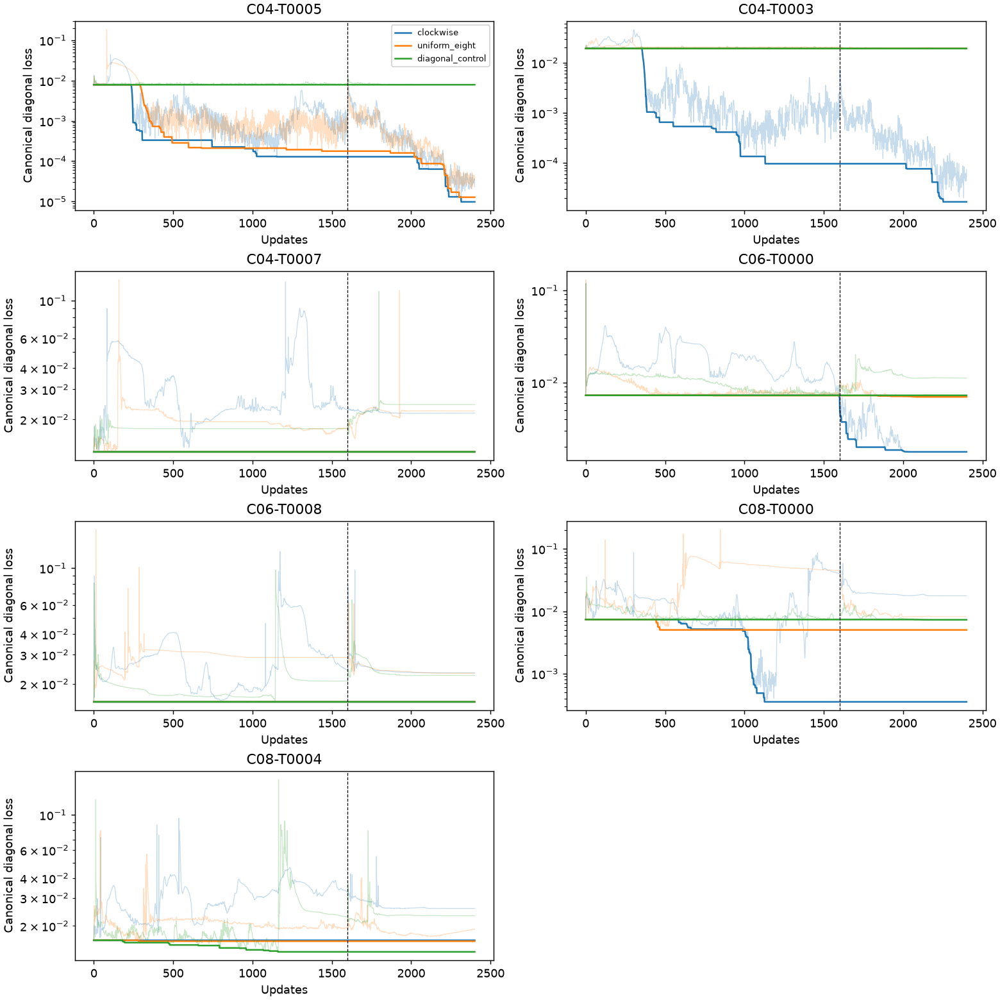

# Clockwise eight-direction descent

Seven plateau cases, three matched runs per case, 2,400 updates each. The first case is development; aggregate comparisons use only the six other failures.

[Protocol](protocol.md) · [Full statistics](summary.csv) · [Raw trajectories](raw-results.zip)

Clockwise ↗ → ↘ ↓ ↙ ← ↖ ↑ blends adjacent directional losses linearly, 100 updates per sector. Two turns, then 800 diagonal-only refinement updates from the actual last state. All runs have the same phase lengths, LR schedule, initial loss scaling and fresh Adam at the phase boundary. All amplitudes stay fixed.

Pitch MAE (cents) / onset MAE (ms):

| Case | Start | Diagonal control | Uniform eight | Clockwise |
|---|---:|---:|---:|---:|
| C04-T0005 (development) | 5.481 / 70.452 | 5.481 / 70.452 | 0.041 / 0.008 | 0.035 / 0.003 |
| C04-T0003 | 42.875 / 101.271 | 42.875 / 101.271 | 42.875 / 101.271 | 0.030 / 0.008 |
| C04-T0007 | 489.887 / 216.169 | 489.887 / 216.169 | 489.887 / 216.169 | 489.887 / 216.169 |
| C06-T0000 | 201.539 / 121.817 | 201.539 / 121.817 | 40.995 / 76.375 | 6.861 / 45.589 |
| C06-T0008 | 310.860 / 216.151 | 310.860 / 216.151 | 310.860 / 216.151 | 310.860 / 216.151 |
| C08-T0000 | 15.798 / 48.300 | 13.232 / 49.637 | 42.198 / 33.823 | 1.473 / 0.334 |
| C08-T0004 | 178.123 / 159.583 | 184.552 / 140.382 | 112.979 / 156.948 | 178.123 / 159.583 |

## Six additional failed phrases

- clockwise: 3/6 improve joint event error versus diagonal control; 1/6 worsen. Median relative reduction 36.78%. 3 gains and 0 regressions exceed 20%. 1 cases reach <1 cent and <1 ms.
- uniform_eight: 2/6 improve joint event error versus diagonal control; 1/6 worsen. Median relative reduction 0.00%. 1 gains and 0 regressions exceed 20%. 0 cases reach <1 cent and <1 ms.

The dashed line marks the switch to diagonal refinement. These curves show the common canonical loss, not the rotating training objective: faint curves are current iterates, bold curves the retained minimum. Final reporting selects the best canonical-loss iterate across exploration/refinement and the starting incumbent. The CSV also contains the unselected endpoints. Parameter errors do not select checkpoints.

Numerical sensitivity: the development fixed-eight run differs from the earlier eight-direction pilot despite identical starting coordinates and round-off-scale initial loss differences. The paths diverge over subsequent updates. [The audit](numerical-sensitivity.json) records this; it does not isolate the effect of equivalent summation order from CPU execution differences. Current paired variants share one process/node per case. Single-run gains are not a robustness result.

One schedule, fixed initial phase, no Log-Weighing or directional scale matching. The clockwise schedule includes a 100-update warm-up; its effect is not separately ablated from the subsequent rotation. These selected plateau restarts do not establish effects on fresh-start training or general convergence. Equal backward counts do not mean equal runtime. A lower canonical loss can still mean larger matched parameter errors.

[Interpretation and checkpoint timing](findings.md) · [Execution and validation](execution.md)
