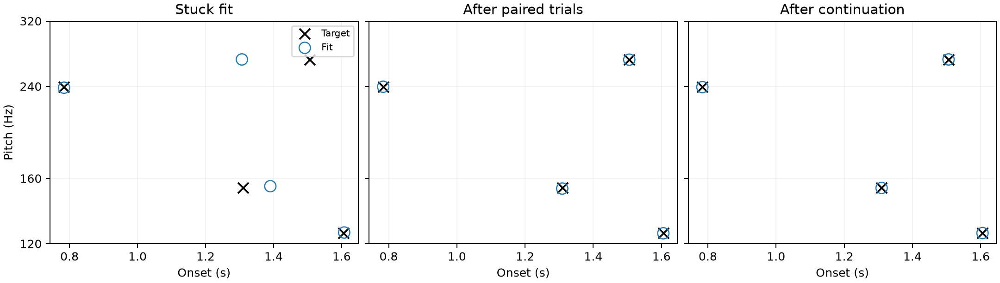

# Complete counterfactual takeover

User follow-up 2026-09-16: preserve the refinement that made an alternative
assignment useful by adopting its whole state, not just its pitch permutation.
Selected-case pilot: same C04-T0005 plateau, canonical four-direction CeL,
2.048 padding, independent times, amplitudes fixed at 0.8.

One sweep tests 1↔2, then 2↔3, then 3↔4. Freeze the live fit during each paired
trial. Keep and swap start from clones of the same live parameters, moments,
Adam step count and LR. Run both for the same number of updates: minimum 30,
then stop when BOTH have gone 40 updates without a relative 1e-4 meaningful
improvement, or at a 300-update cap. These settings are pilot choices, not tuned
or established general settings. Trial LR stays .05 initially, no decay during
paired trials. All losses use fixed original plateau-loss conditioning.

For each branch retain its strict-best complete state. Accept the swap only if
its best canonical loss is at least 1% below BOTH the live checkpoint and the
best keep branch. Otherwise adopt keep if it beats live by 1%; else stay put.
Acceptance transfers raw controls, complete permutation, first/second moments,
step count and LR from the SAME selected checkpoint. Exact equality checks
verify isolation during trial and full-state takeover; re-rendering verifies
the accepted loss. This is a hard branch decision, not soft pitch interpolation.

Only after a paired trial finishes do we advance to the next adjacent pair.
After one complete sweep, continue ordinary canonical Adam from the adopted
state for up to 3000 further updates. This continuation preserves moments and
step count initially, then uses plateau patience 100/200, LR factor .3 and
stop patience 250, meaningful relative improvement 1e-4. Later plateau recovery
restores the complete best state, clears moments and reduces LR (floor 1e-5).
This is a research pilot, not an alteration to the registered production fitter.

The original failed state contains controls but no saved live Adam moments;
the first trial therefore starts with zero moments and LR .05. Subsequent
trials and continuation carry the accepted state. Selection never uses target
coordinates or matched errors; only canonical audio loss. Compute is greater
than ordinary descent; no equal-compute performance claim is made.

Run `python scripts/test_counterfactual_takeover.py` with the project Python and
PYTHONHOME set to `.pixi/envs/default`.

## Results

The whole-state takeover **recovers this four-event case**. The paired decisions
were:

| Pair | Updates per branch | Decision |
|---|---:|---|
| 1↔2 | 163 | retain live |
| 2↔3 | 120 | adopt complete swapped state |
| 3↔4 | 182 | reject swap; adopt improved keep state |

All three paired trials stopped by patience before the 300-update cap. For
2↔3, the accepted strict-best state was at trial update 80, including its Adam
moments and count; the trial continued to update 120 before patience terminated
it. Its canonical loss was **0.000811545**, down from **0.007878667**, with
matched errors **1.451943 cents / 0.634515 ms** and the correct event association.

The following keep branch improved the loss to **0.000530123**, with errors
**2.720155 cents / 0.242641 ms**. The pitch-error change illustrates that
acceptance uses the audio objective, not target-parameter errors.

Continuing from the adopted full state reached canonical CeL **9.89659e-8**,
matched pitch MAE **0.000160269 cents**, onset MAE **0.000084737 ms**, and the
correct temporal pitch association. All excitation amplitudes stayed 0.8.

Paired trials cost **930 Adam updates total** across both branches. Subsequent
continuation used 2445 further updates. Thus this result is not an
equal-compute comparison with ordinary descent. The first live checkpoint
starts with fresh moments because the old run did not save them; thereafter
accepted state is preserved. This single-case success does not establish
performance on the full recovery set, optimal trial budgets, or a universally
appropriate 1% threshold.

Exact checks passed for live-state isolation, copied parameters/moments/count/LR,
loss reproduction after takeover, and the acceptance inequalities. Committed
loss never increases across the three decisions. The final complete checkpoint
is retained, including moments and fixed objective-conditioning scale.

Artifacts: [all decisions, traces and checkpoint](result.json),
[numerical decision table](decisions.md). Recreate the figure with
`python scripts/report_counterfactual_takeover.py`.

