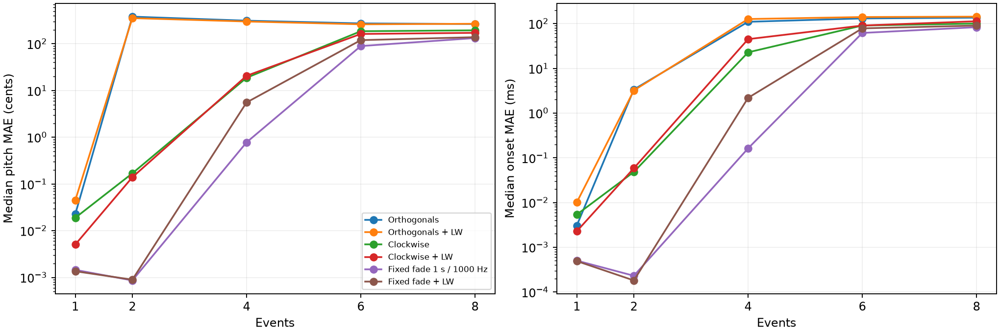
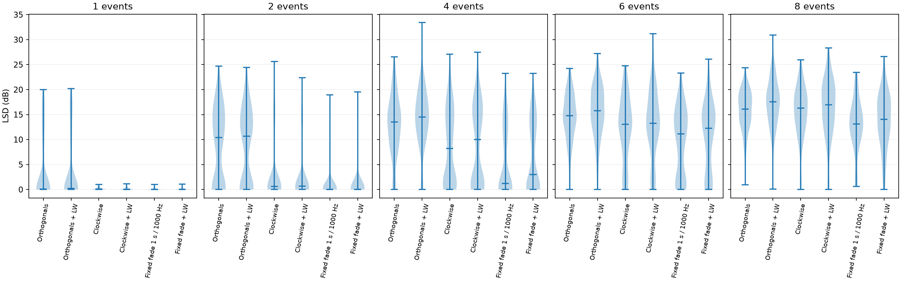

# Full orthogonal / clockwise / fixed-fading recovery

**Complete:** 750 frozen targets × six methods = 4,500 fits. Each method has 150 targets at each of 1/2/4/6/8 events.

[Protocol](protocol.md) · [Per-phrase results](per_phrase.csv) · [Mean, SD and median](summary.csv) · [Paired comparisons](paired_changes.csv) · [Selected states](selected-results.json.gz)

All methods start from the standard initial guess and use the same Adam, patience, rollback and ≤3,000-update cap. Clockwise rotates throughout, without a diagonal pre-fit, warm-up or refinement. Actual updates and runtime may differ.

For clockwise fits, gradients use the rotating loss; the fixed eight-direction average with matching Log-Weighing controls patience and checkpoint selection. Orthogonal fits monitor their static four-direction objective. The monitor is not used for clockwise backward updates.

Fixed fading uses all four diagonal directions, with logarithmic fade-to-zero horizons of 1 second and 1000 Hz throughout. Uniform and Log-Weighed variants use their own fixed training loss for patience and checkpoint selection.

## Median recovery errors

Pitch MAE (cents) / onset MAE (ms), medians across 150 phrases.

| Method | 1 event | 2 events | 4 events | 6 events | 8 events |
|---|---:|---:|---:|---:|---:|
| Orthogonals | 0.023 / 0.003 | 381.120 / 3.373 | 312.750 / 109.881 | 273.455 / 130.565 | 265.194 / 136.009 |
| Orthogonals + LW | 0.045 / 0.010 | 354.675 / 3.214 | 300.222 / 126.664 | 261.582 / 140.426 | 268.302 / 143.107 |
| Clockwise | 0.019 / 0.005 | 0.169 / 0.048 | 18.770 / 22.799 | 185.969 / 90.637 | 194.156 / 100.378 |
| Clockwise + LW | 0.005 / 0.002 | 0.139 / 0.059 | 20.702 / 44.958 | 162.536 / 90.706 | 171.841 / 112.956 |
| Fixed fade 1 s / 1000 Hz | 0.001 / 0.001 | 0.001 / 0.000 | 0.780 / 0.163 | 89.509 / 61.869 | 132.715 / 83.241 |
| Fixed fade + LW | 0.001 / 0.000 | 0.001 / 0.000 | 5.561 / 2.191 | 119.825 / 78.347 | 138.676 / 90.546 |

## Compute and recovery counts

| Events | Method | Median updates | Median seconds | Patience stops | <1 cent and <1 ms |
|---:|---|---:|---:|---:|---:|
| 1 | Orthogonals | 574 | 25.6 | 148/150 | 108/150 |
| 1 | Orthogonals + LW | 542 | 22.9 | 145/150 | 110/150 |
| 1 | Clockwise | 608 | 32.6 | 150/150 | 150/150 |
| 1 | Clockwise + LW | 766 | 43.1 | 150/150 | 150/150 |
| 1 | Fixed fade 1 s / 1000 Hz | 1043 | 53.6 | 149/150 | 150/150 |
| 1 | Fixed fade + LW | 1244 | 60.1 | 146/150 | 150/150 |
| 2 | Orthogonals | 718 | 35.5 | 148/150 | 53/150 |
| 2 | Orthogonals + LW | 780 | 38.0 | 148/150 | 54/150 |
| 2 | Clockwise | 983 | 55.1 | 147/150 | 114/150 |
| 2 | Clockwise + LW | 982 | 55.5 | 149/150 | 114/150 |
| 2 | Fixed fade 1 s / 1000 Hz | 1648 | 87.8 | 148/150 | 138/150 |
| 2 | Fixed fade + LW | 1654 | 83.9 | 149/150 | 129/150 |
| 4 | Orthogonals | 912 | 51.2 | 150/150 | 15/150 |
| 4 | Orthogonals + LW | 872 | 47.3 | 147/150 | 10/150 |
| 4 | Clockwise | 1142 | 71.2 | 145/150 | 49/150 |
| 4 | Clockwise + LW | 1088 | 73.1 | 150/150 | 45/150 |
| 4 | Fixed fade 1 s / 1000 Hz | 1386 | 86.7 | 147/150 | 78/150 |
| 4 | Fixed fade + LW | 1278 | 77.4 | 148/150 | 67/150 |
| 6 | Orthogonals | 1077 | 65.7 | 150/150 | 5/150 |
| 6 | Orthogonals + LW | 978 | 58.6 | 150/150 | 2/150 |
| 6 | Clockwise | 1495 | 103.8 | 141/150 | 18/150 |
| 6 | Clockwise + LW | 1432 | 95.4 | 149/150 | 11/150 |
| 6 | Fixed fade 1 s / 1000 Hz | 1278 | 80.9 | 146/150 | 35/150 |
| 6 | Fixed fade + LW | 1130 | 70.2 | 148/150 | 30/150 |
| 8 | Orthogonals | 1080 | 66.9 | 150/150 | 1/150 |
| 8 | Orthogonals + LW | 1072 | 71.9 | 149/150 | 1/150 |
| 8 | Clockwise | 1736 | 127.8 | 141/150 | 5/150 |
| 8 | Clockwise + LW | 1650 | 122.4 | 144/150 | 7/150 |
| 8 | Fixed fade 1 s / 1000 Hz | 1263 | 83.2 | 144/150 | 9/150 |
| 8 | Fixed fade + LW | 1194 | 82.2 | 146/150 | 6/150 |

Paired differences compare each named variant and reference on the same targets. Negative variant-minus-reference differences favour the variant. These are descriptive comparisons, not new significance claims.

The full CSV includes mean/sample SD/median. LSD exactly follows the original paper metric. Joint event error is the registered RMS matched distance. Ground-truth errors never select checkpoints. Full trajectories remain under `results/direction-recovery-150/raw`; the manifest hashes every accepted shard. Superseded staged-clockwise outputs are excluded.
