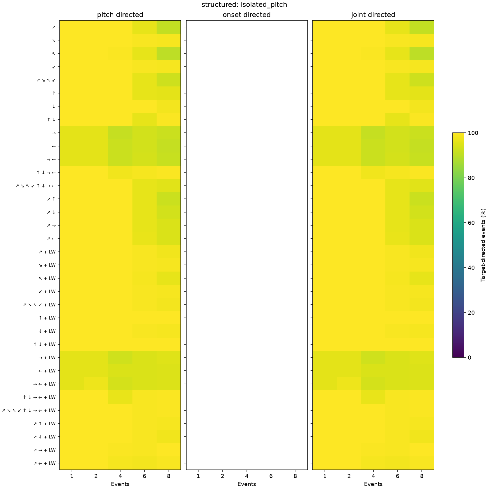
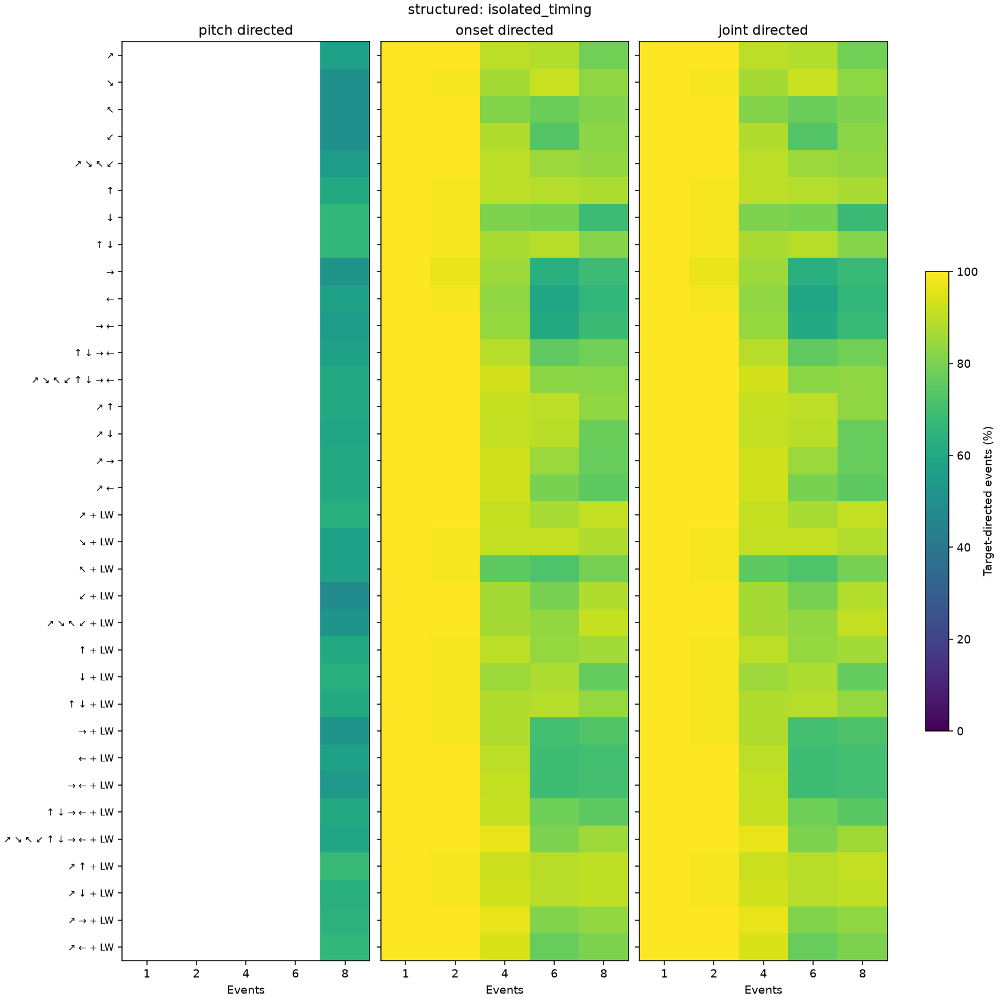
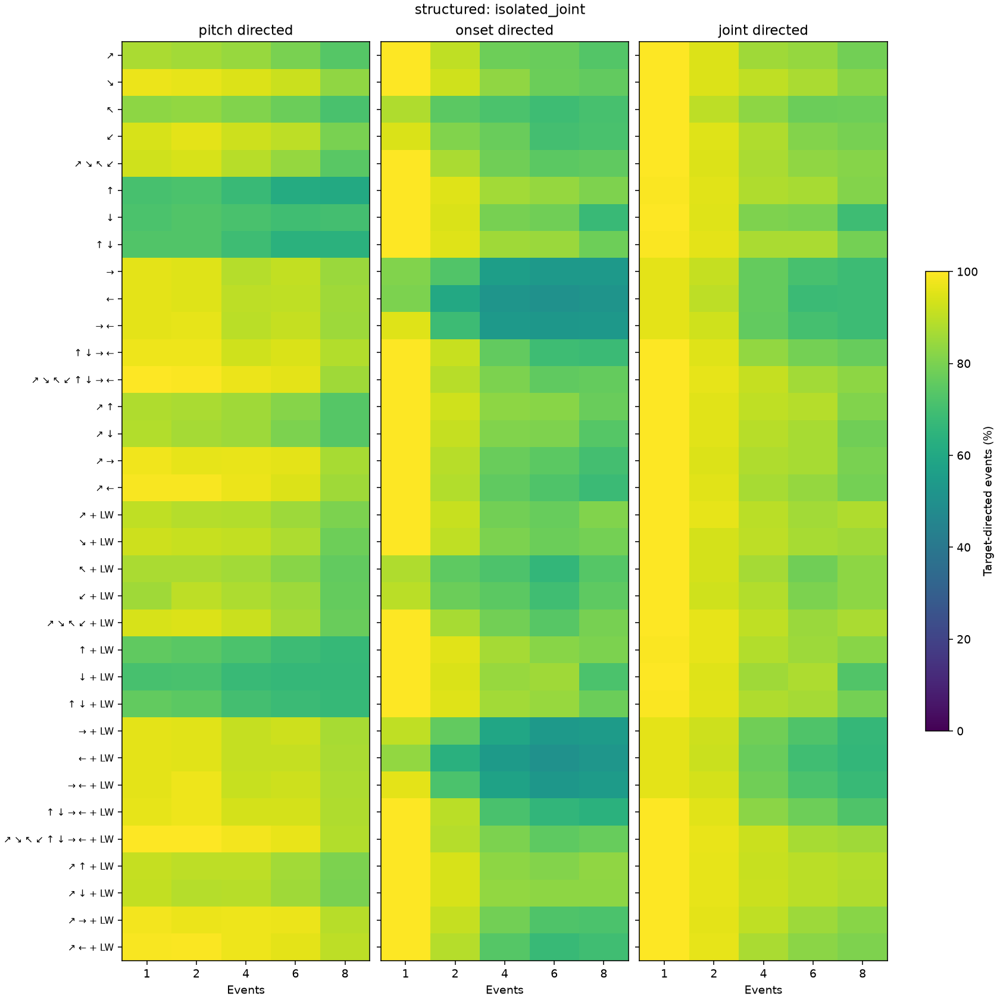
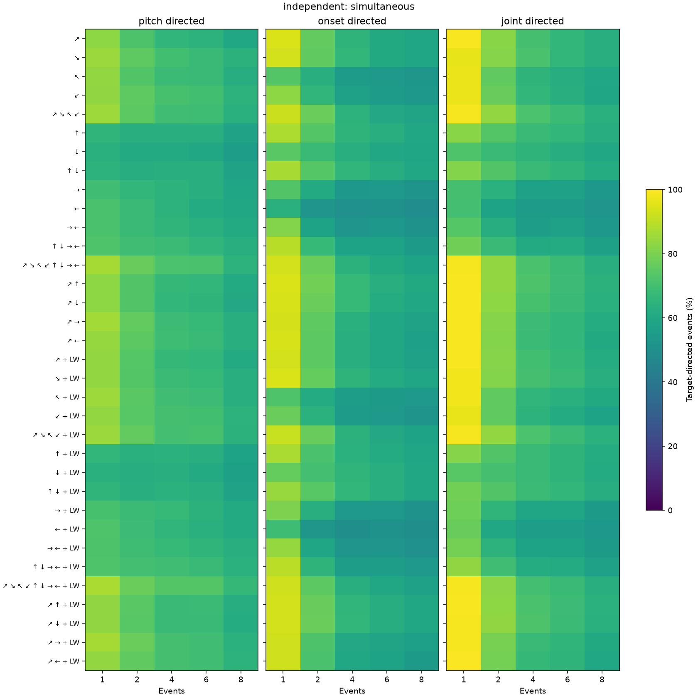

# Eight-direction CeL gradient screen

All 255 nonempty subsets, each uniform and with Log-Weighing (510 configurations). Same 173 targets and 13,099 candidate phrases as the earlier diagonal screen. This is a local-gradient screen, not a gradient-descent experiment.

[Findings](findings.md) · [Protocol](protocol.md) · [Full CSV, compressed](summary.csv.gz) · [Interactive table](explorer.html) · [All-subset plots](all-subsets.pdf) · [Raw arrays](raw-results.zip)

Each entry below is pitch / onset / joint target-directed event percentage. Targets are weighted equally within each condition and event count. A dash means no displaced coordinates eligible for that statistic. Full CSV includes sample SD, median, cosine alignment and correct-coordinate drift.

## structured: isolated_pitch

| Subset | 1 event | 2 events | 4 events | 6 events | 8 events |
|---|---:|---:|---:|---:|---:|
| ↗ | 100.0 / — / 100.0 | 100.0 / — / 100.0 | 100.0 / — / 100.0 | 96.3 / — / 96.3 | 90.8 / — / 90.8 |
| ↘ | 100.0 / — / 100.0 | 100.0 / — / 100.0 | 100.0 / — / 100.0 | 99.1 / — / 99.1 | 98.7 / — / 98.7 |
| ↖ | 100.0 / — / 100.0 | 100.0 / — / 100.0 | 99.3 / — / 99.3 | 96.3 / — / 96.3 | 90.2 / — / 90.2 |
| ↙ | 100.0 / — / 100.0 | 100.0 / — / 100.0 | 100.0 / — / 100.0 | 99.1 / — / 99.1 | 98.7 / — / 98.7 |
| ↗ ↘ ↖ ↙ | 100.0 / — / 100.0 | 100.0 / — / 100.0 | 100.0 / — / 100.0 | 96.3 / — / 96.3 | 92.4 / — / 92.4 |
| ↑ | 100.0 / — / 100.0 | 100.0 / — / 100.0 | 100.0 / — / 100.0 | 96.3 / — / 96.3 | 95.9 / — / 95.9 |
| ↓ | 100.0 / — / 100.0 | 100.0 / — / 100.0 | 100.0 / — / 100.0 | 100.0 / — / 100.0 | 98.1 / — / 98.1 |
| ↑ ↓ | 100.0 / — / 100.0 | 100.0 / — / 100.0 | 100.0 / — / 100.0 | 96.3 / — / 96.3 | 99.4 / — / 99.4 |
| → | 95.8 / — / 95.8 | 96.1 / — / 96.1 | 91.4 / — / 91.4 | 93.1 / — / 93.1 | 92.1 / — / 92.1 |
| ← | 95.8 / — / 95.8 | 96.1 / — / 96.1 | 92.1 / — / 92.1 | 93.2 / — / 93.2 | 91.1 / — / 91.1 |
| → ← | 95.8 / — / 95.8 | 96.1 / — / 96.1 | 92.1 / — / 92.1 | 93.5 / — / 93.5 | 91.4 / — / 91.4 |
| ↑ ↓ → ← | 100.0 / — / 100.0 | 100.0 / — / 100.0 | 98.0 / — / 98.0 | 98.7 / — / 98.7 | 99.4 / — / 99.4 |
| ↗ ↘ ↖ ↙ ↑ ↓ → ← | 100.0 / — / 100.0 | 100.0 / — / 100.0 | 100.0 / — / 100.0 | 96.3 / — / 96.3 | 95.6 / — / 95.6 |
| ↗ ↑ | 100.0 / — / 100.0 | 100.0 / — / 100.0 | 100.0 / — / 100.0 | 96.3 / — / 96.3 | 92.1 / — / 92.1 |
| ↗ ↓ | 100.0 / — / 100.0 | 100.0 / — / 100.0 | 100.0 / — / 100.0 | 96.3 / — / 96.3 | 93.1 / — / 93.1 |
| ↗ → | 100.0 / — / 100.0 | 100.0 / — / 100.0 | 100.0 / — / 100.0 | 96.3 / — / 96.3 | 94.2 / — / 94.2 |
| ↗ ← | 100.0 / — / 100.0 | 100.0 / — / 100.0 | 100.0 / — / 100.0 | 96.8 / — / 96.8 | 94.2 / — / 94.2 |
| ↗ + LW | 100.0 / — / 100.0 | 100.0 / — / 100.0 | 100.0 / — / 100.0 | 99.1 / — / 99.1 | 97.7 / — / 97.7 |
| ↘ + LW | 100.0 / — / 100.0 | 100.0 / — / 100.0 | 100.0 / — / 100.0 | 99.1 / — / 99.1 | 98.7 / — / 98.7 |
| ↖ + LW | 100.0 / — / 100.0 | 100.0 / — / 100.0 | 100.0 / — / 100.0 | 98.7 / — / 98.7 | 96.5 / — / 96.5 |
| ↙ + LW | 100.0 / — / 100.0 | 100.0 / — / 100.0 | 100.0 / — / 100.0 | 99.1 / — / 99.1 | 98.7 / — / 98.7 |
| ↗ ↘ ↖ ↙ + LW | 100.0 / — / 100.0 | 100.0 / — / 100.0 | 100.0 / — / 100.0 | 99.1 / — / 99.1 | 98.4 / — / 98.4 |
| ↑ + LW | 100.0 / — / 100.0 | 100.0 / — / 100.0 | 100.0 / — / 100.0 | 100.0 / — / 100.0 | 100.0 / — / 100.0 |
| ↓ + LW | 100.0 / — / 100.0 | 100.0 / — / 100.0 | 100.0 / — / 100.0 | 99.1 / — / 99.1 | 98.7 / — / 98.7 |
| ↑ ↓ + LW | 100.0 / — / 100.0 | 100.0 / — / 100.0 | 100.0 / — / 100.0 | 100.0 / — / 100.0 | 99.7 / — / 99.7 |
| → + LW | 95.8 / — / 95.8 | 96.1 / — / 96.1 | 92.8 / — / 92.8 | 94.5 / — / 94.5 | 95.2 / — / 95.2 |
| ← + LW | 95.8 / — / 95.8 | 96.1 / — / 96.1 | 94.2 / — / 94.2 | 94.5 / — / 94.5 | 94.6 / — / 94.6 |
| → ← + LW | 95.8 / — / 95.8 | 97.5 / — / 97.5 | 93.5 / — / 93.5 | 94.5 / — / 94.5 | 94.6 / — / 94.6 |
| ↑ ↓ → ← + LW | 100.0 / — / 100.0 | 100.0 / — / 100.0 | 96.8 / — / 96.8 | 99.1 / — / 99.1 | 99.4 / — / 99.4 |
| ↗ ↘ ↖ ↙ ↑ ↓ → ← + LW | 100.0 / — / 100.0 | 100.0 / — / 100.0 | 100.0 / — / 100.0 | 99.1 / — / 99.1 | 99.4 / — / 99.4 |
| ↗ ↑ + LW | 100.0 / — / 100.0 | 100.0 / — / 100.0 | 100.0 / — / 100.0 | 99.1 / — / 99.1 | 98.7 / — / 98.7 |
| ↗ ↓ + LW | 100.0 / — / 100.0 | 100.0 / — / 100.0 | 100.0 / — / 100.0 | 99.1 / — / 99.1 | 97.7 / — / 97.7 |
| ↗ → + LW | 100.0 / — / 100.0 | 100.0 / — / 100.0 | 99.3 / — / 99.3 | 99.1 / — / 99.1 | 100.0 / — / 100.0 |
| ↗ ← + LW | 100.0 / — / 100.0 | 100.0 / — / 100.0 | 98.7 / — / 98.7 | 98.3 / — / 98.3 | 99.0 / — / 99.0 |
## structured: isolated_timing

| Subset | 1 event | 2 events | 4 events | 6 events | 8 events |
|---|---:|---:|---:|---:|---:|
| ↗ | — / 100.0 / 100.0 | — / 100.0 / 100.0 | — / 90.0 / 90.0 | — / 88.5 / 88.5 | 57.1 / 78.9 / 78.7 |
| ↘ | — / 100.0 / 100.0 | — / 98.6 / 98.6 | — / 86.7 / 86.7 | — / 91.7 / 91.7 | 50.0 / 83.2 / 83.1 |
| ↖ | — / 100.0 / 100.0 | — / 100.0 / 100.0 | — / 81.3 / 81.3 | — / 77.6 / 77.6 | 50.0 / 81.1 / 80.8 |
| ↙ | — / 100.0 / 100.0 | — / 100.0 / 100.0 | — / 88.0 / 88.0 | — / 73.3 / 73.3 | 50.0 / 82.7 / 82.6 |
| ↗ ↘ ↖ ↙ | — / 100.0 / 100.0 | — / 100.0 / 100.0 | — / 90.0 / 90.0 | — / 84.8 / 84.8 | 55.4 / 83.9 / 83.7 |
| ↑ | — / 100.0 / 100.0 | — / 98.6 / 98.6 | — / 90.0 / 90.0 | — / 88.9 / 88.9 | 60.7 / 87.6 / 87.4 |
| ↓ | — / 100.0 / 100.0 | — / 98.6 / 98.6 | — / 80.7 / 80.7 | — / 80.0 / 80.0 | 66.1 / 68.4 / 68.2 |
| ↑ ↓ | — / 100.0 / 100.0 | — / 98.6 / 98.6 | — / 87.3 / 87.3 | — / 89.1 / 89.1 | 66.1 / 81.8 / 81.8 |
| → | — / 100.0 / 100.0 | — / 97.1 / 97.1 | — / 85.3 / 85.3 | — / 63.5 / 63.5 | 51.8 / 68.7 / 67.9 |
| ← | — / 100.0 / 100.0 | — / 98.6 / 98.6 | — / 83.3 / 83.3 | — / 59.1 / 59.1 | 57.1 / 66.1 / 66.1 |
| → ← | — / 100.0 / 100.0 | — / 100.0 / 100.0 | — / 84.0 / 84.0 | — / 61.1 / 61.1 | 55.4 / 68.2 / 67.9 |
| ↑ ↓ → ← | — / 100.0 / 100.0 | — / 100.0 / 100.0 | — / 89.3 / 89.3 | — / 75.7 / 75.7 | 57.1 / 78.7 / 78.5 |
| ↗ ↘ ↖ ↙ ↑ ↓ → ← | — / 100.0 / 100.0 | — / 100.0 / 100.0 | — / 93.3 / 93.3 | — / 82.6 / 82.6 | 60.7 / 82.3 / 83.2 |
| ↗ ↑ | — / 100.0 / 100.0 | — / 100.0 / 100.0 | — / 91.3 / 91.3 | — / 90.2 / 90.2 | 60.7 / 83.4 / 83.4 |
| ↗ ↓ | — / 100.0 / 100.0 | — / 100.0 / 100.0 | — / 90.7 / 90.7 | — / 89.8 / 89.8 | 58.9 / 77.4 / 76.9 |
| ↗ → | — / 100.0 / 100.0 | — / 100.0 / 100.0 | — / 92.7 / 92.7 | — / 85.0 / 85.0 | 60.7 / 76.8 / 76.6 |
| ↗ ← | — / 100.0 / 100.0 | — / 100.0 / 100.0 | — / 92.7 / 92.7 | — / 80.0 / 80.0 | 60.7 / 75.2 / 75.0 |
| ↗ + LW | — / 100.0 / 100.0 | — / 100.0 / 100.0 | — / 91.3 / 91.3 | — / 87.0 / 87.0 | 62.5 / 90.8 / 90.8 |
| ↘ + LW | — / 100.0 / 100.0 | — / 98.6 / 98.6 | — / 90.7 / 90.7 | — / 90.7 / 90.7 | 57.1 / 88.2 / 88.4 |
| ↖ + LW | — / 100.0 / 100.0 | — / 98.6 / 98.6 | — / 75.3 / 75.3 | — / 72.4 / 72.4 | 57.1 / 79.4 / 79.4 |
| ↙ + LW | — / 100.0 / 100.0 | — / 100.0 / 100.0 | — / 86.7 / 86.7 | — / 79.3 / 79.3 | 48.2 / 88.1 / 88.4 |
| ↗ ↘ ↖ ↙ + LW | — / 100.0 / 100.0 | — / 100.0 / 100.0 | — / 86.7 / 86.7 | — / 83.9 / 83.9 | 51.8 / 91.1 / 90.8 |
| ↑ + LW | — / 100.0 / 100.0 | — / 98.6 / 98.6 | — / 90.0 / 90.0 | — / 84.3 / 84.3 | 60.7 / 86.3 / 86.3 |
| ↓ + LW | — / 100.0 / 100.0 | — / 98.6 / 98.6 | — / 85.3 / 85.3 | — / 87.6 / 87.6 | 62.5 / 76.5 / 76.5 |
| ↑ ↓ + LW | — / 100.0 / 100.0 | — / 98.6 / 98.6 | — / 88.0 / 88.0 | — / 88.7 / 88.7 | 60.7 / 84.2 / 84.4 |
| → + LW | — / 100.0 / 100.0 | — / 98.6 / 98.6 | — / 88.0 / 88.0 | — / 70.0 / 70.0 | 51.8 / 72.7 / 72.3 |
| ← + LW | — / 100.0 / 100.0 | — / 100.0 / 100.0 | — / 90.0 / 90.0 | — / 68.9 / 68.9 | 57.1 / 69.8 / 70.2 |
| → ← + LW | — / 100.0 / 100.0 | — / 100.0 / 100.0 | — / 90.7 / 90.7 | — / 69.1 / 69.1 | 53.6 / 70.5 / 70.0 |
| ↑ ↓ → ← + LW | — / 100.0 / 100.0 | — / 100.0 / 100.0 | — / 91.3 / 91.3 | — / 78.0 / 78.0 | 60.7 / 75.0 / 74.5 |
| ↗ ↘ ↖ ↙ ↑ ↓ → ← + LW | — / 100.0 / 100.0 | — / 100.0 / 100.0 | — / 96.7 / 96.7 | — / 80.2 / 80.2 | 58.9 / 85.3 / 85.6 |
| ↗ ↑ + LW | — / 100.0 / 100.0 | — / 98.6 / 98.6 | — / 92.0 / 92.0 | — / 89.1 / 89.1 | 67.9 / 90.5 / 90.6 |
| ↗ ↓ + LW | — / 100.0 / 100.0 | — / 98.6 / 98.6 | — / 92.7 / 92.7 | — / 89.1 / 89.1 | 62.5 / 90.3 / 90.5 |
| ↗ → + LW | — / 100.0 / 100.0 | — / 100.0 / 100.0 | — / 96.7 / 96.7 | — / 81.1 / 81.1 | 64.3 / 83.9 / 83.5 |
| ↗ ← + LW | — / 100.0 / 100.0 | — / 100.0 / 100.0 | — / 94.0 / 94.0 | — / 76.7 / 76.7 | 66.1 / 80.2 / 80.2 |
## structured: isolated_joint

| Subset | 1 event | 2 events | 4 events | 6 events | 8 events |
|---|---:|---:|---:|---:|---:|
| ↗ | 87.4 / 100.0 / 100.0 | 85.9 / 90.3 / 94.7 | 84.5 / 78.0 / 85.7 | 79.7 / 77.2 / 84.2 | 73.5 / 73.2 / 78.6 |
| ↘ | 97.1 / 100.0 / 100.0 | 96.2 / 92.6 / 94.8 | 94.6 / 83.3 / 90.4 | 92.1 / 77.5 / 87.5 | 83.4 / 76.0 / 82.2 |
| ↖ | 83.0 / 88.2 / 100.0 | 83.6 / 74.9 / 90.0 | 81.2 / 71.8 / 83.0 | 77.3 / 68.8 / 77.4 | 71.3 / 71.1 / 77.8 |
| ↙ | 93.8 / 94.4 / 100.0 | 95.8 / 81.1 / 94.9 | 92.5 / 77.3 / 88.1 | 90.1 / 69.9 / 81.4 | 79.7 / 71.5 / 79.7 |
| ↗ ↘ ↖ ↙ | 92.8 / 100.0 / 100.0 | 94.0 / 87.4 / 94.6 | 89.4 / 78.2 / 87.5 | 84.2 / 74.9 / 83.6 | 74.6 / 75.4 / 81.7 |
| ↑ | 71.1 / 100.0 / 99.4 | 71.8 / 95.2 / 95.6 | 67.8 / 86.2 / 88.3 | 61.7 / 84.3 / 86.8 | 60.7 / 80.7 / 81.4 |
| ↓ | 71.5 / 100.0 / 100.0 | 72.7 / 94.2 / 95.0 | 71.4 / 79.4 / 80.9 | 69.4 / 78.5 / 79.7 | 70.2 / 67.8 / 68.9 |
| ↑ ↓ | 72.8 / 100.0 / 99.4 | 73.0 / 95.2 / 95.8 | 68.9 / 85.7 / 87.2 | 63.7 / 84.9 / 87.3 | 64.0 / 78.0 / 79.3 |
| → | 95.8 / 81.0 / 95.8 | 95.3 / 72.9 / 91.2 | 89.0 / 56.1 / 76.3 | 90.8 / 53.7 / 70.8 | 85.0 / 53.6 / 68.6 |
| ← | 95.8 / 80.3 / 95.8 | 95.3 / 60.5 / 90.2 | 89.9 / 52.1 / 76.2 | 90.5 / 50.6 / 68.0 | 85.7 / 51.8 / 68.5 |
| → ← | 95.8 / 94.9 / 95.8 | 96.3 / 68.5 / 92.8 | 89.5 / 54.2 / 76.0 | 91.2 / 52.8 / 70.5 | 85.2 / 53.4 / 68.7 |
| ↑ ↓ → ← | 97.4 / 100.0 / 100.0 | 97.4 / 91.5 / 95.1 | 92.9 / 75.8 / 83.9 | 94.2 / 69.0 / 79.0 | 88.3 / 68.2 / 76.8 |
| ↗ ↘ ↖ ↙ ↑ ↓ → ← | 100.0 / 100.0 / 100.0 | 99.6 / 89.2 / 96.4 | 97.1 / 80.1 / 91.2 | 95.7 / 75.5 / 86.2 | 85.7 / 76.3 / 82.9 |
| ↗ ↑ | 87.9 / 100.0 / 100.0 | 87.2 / 92.6 / 95.4 | 85.9 / 83.0 / 90.3 | 81.9 / 82.3 / 88.9 | 73.7 / 77.1 / 81.1 |
| ↗ ↓ | 88.5 / 100.0 / 100.0 | 86.5 / 91.2 / 95.6 | 85.2 / 81.2 / 89.2 | 80.2 / 80.7 / 86.9 | 73.8 / 73.5 / 78.4 |
| ↗ → | 97.7 / 100.0 / 100.0 | 96.2 / 89.3 / 94.6 | 96.7 / 77.2 / 88.2 | 95.7 / 74.7 / 87.1 | 86.9 / 70.3 / 80.0 |
| ↗ ← | 98.9 / 100.0 / 100.0 | 99.0 / 88.6 / 95.6 | 97.1 / 75.8 / 86.9 | 94.9 / 72.3 / 84.4 | 85.6 / 68.3 / 79.2 |
| ↗ + LW | 90.3 / 100.0 / 100.0 | 88.9 / 91.7 / 96.5 | 88.5 / 78.9 / 89.5 | 85.4 / 76.8 / 86.2 | 80.4 / 80.9 / 88.1 |
| ↘ + LW | 92.6 / 100.0 / 100.0 | 91.7 / 90.3 / 93.4 | 90.8 / 80.1 / 89.9 | 87.6 / 77.5 / 86.9 | 77.7 / 79.0 / 85.7 |
| ↖ + LW | 87.4 / 88.2 / 100.0 | 87.4 / 75.3 / 93.4 | 86.3 / 71.9 / 86.5 | 82.3 / 66.1 / 78.2 | 75.9 / 73.7 / 82.9 |
| ↙ + LW | 85.8 / 89.8 / 100.0 | 89.9 / 77.6 / 92.8 | 87.6 / 74.9 / 88.5 | 85.2 / 69.5 / 80.2 | 76.4 / 75.1 / 83.1 |
| ↗ ↘ ↖ ↙ + LW | 93.8 / 100.0 / 100.0 | 94.8 / 87.0 / 96.2 | 91.9 / 78.8 / 90.5 | 86.6 / 74.0 / 84.9 | 77.3 / 79.7 / 87.4 |
| ↑ + LW | 75.5 / 100.0 / 99.4 | 74.5 / 95.6 / 96.2 | 71.8 / 86.7 / 88.4 | 68.6 / 82.1 / 85.2 | 66.9 / 80.3 / 82.1 |
| ↓ + LW | 71.0 / 100.0 / 100.0 | 71.2 / 94.2 / 95.0 | 67.8 / 84.7 / 85.9 | 66.8 / 85.6 / 87.8 | 66.4 / 71.6 / 72.9 |
| ↑ ↓ + LW | 76.1 / 100.0 / 99.4 | 74.7 / 95.0 / 95.4 | 70.2 / 86.0 / 88.1 | 68.1 / 84.8 / 86.5 | 66.8 / 77.6 / 78.9 |
| → + LW | 95.8 / 90.5 / 95.8 | 95.7 / 75.9 / 92.4 | 91.2 / 59.3 / 78.2 | 92.2 / 54.2 / 72.5 | 87.0 / 54.9 / 66.6 |
| ← + LW | 95.8 / 83.6 / 95.8 | 95.5 / 63.6 / 92.0 | 91.4 / 54.4 / 77.3 | 91.4 / 50.5 / 69.3 | 87.2 / 52.5 / 66.1 |
| → ← + LW | 95.8 / 96.1 / 95.8 | 97.5 / 71.8 / 93.6 | 91.7 / 57.6 / 78.5 | 92.2 / 53.0 / 71.8 | 87.6 / 54.8 / 67.5 |
| ↑ ↓ → ← + LW | 96.4 / 100.0 / 100.0 | 97.3 / 89.6 / 95.7 | 93.7 / 71.1 / 82.6 | 93.6 / 66.0 / 77.9 | 88.0 / 63.8 / 72.4 |
| ↗ ↘ ↖ ↙ ↑ ↓ → ← + LW | 100.0 / 100.0 / 100.0 | 100.0 / 89.0 / 96.8 | 98.3 / 80.2 / 92.1 | 96.8 / 75.2 / 87.1 | 88.7 / 76.6 / 85.6 |
| ↗ ↑ + LW | 91.4 / 100.0 / 100.0 | 90.2 / 93.8 / 96.4 | 90.0 / 82.9 / 91.8 | 86.3 / 81.4 / 89.8 | 80.3 / 83.3 / 88.5 |
| ↗ ↓ + LW | 90.8 / 100.0 / 100.0 | 89.0 / 94.0 / 96.4 | 89.2 / 83.7 / 92.0 | 85.8 / 82.9 / 89.6 | 79.9 / 83.2 / 88.0 |
| ↗ → + LW | 98.3 / 100.0 / 100.0 | 97.2 / 91.3 / 96.0 | 97.4 / 78.6 / 90.4 | 97.0 / 72.6 / 85.3 | 89.3 / 71.6 / 82.1 |
| ↗ ← + LW | 98.9 / 100.0 / 100.0 | 99.3 / 89.1 / 96.4 | 97.6 / 73.6 / 87.3 | 96.0 / 67.4 / 82.5 | 89.9 / 69.4 / 80.7 |
## independent: simultaneous

| Subset | 1 event | 2 events | 4 events | 6 events | 8 events |
|---|---:|---:|---:|---:|---:|
| ↗ | 82.9 / 94.3 / 99.0 | 72.1 / 76.1 / 82.4 | 65.8 / 64.9 / 70.3 | 64.5 / 60.7 / 66.4 | 59.9 / 58.7 / 62.6 |
| ↘ | 84.8 / 93.2 / 96.2 | 75.2 / 75.6 / 81.7 | 69.9 / 66.1 / 71.3 | 67.8 / 60.8 / 66.1 | 64.2 / 58.8 / 62.9 |
| ↖ | 83.6 / 73.3 / 97.0 | 72.9 / 63.1 / 75.6 | 68.1 / 55.3 / 64.9 | 67.6 / 53.7 / 62.4 | 62.2 / 52.9 / 59.6 |
| ↙ | 83.3 / 82.9 / 96.9 | 75.1 / 65.9 / 76.9 | 71.0 / 57.3 / 66.0 | 69.7 / 55.1 / 62.6 | 64.5 / 53.2 / 58.9 |
| ↗ ↘ ↖ ↙ | 85.2 / 92.0 / 98.5 | 74.8 / 77.0 / 83.9 | 69.2 / 64.6 / 71.5 | 68.8 / 60.2 / 68.1 | 63.3 / 58.3 / 63.5 |
| ↑ | 65.4 / 87.5 / 82.2 | 62.6 / 73.1 / 73.1 | 62.8 / 65.2 / 67.7 | 62.6 / 62.6 / 66.1 | 57.7 / 59.7 / 62.2 |
| ↓ | 63.6 / 74.6 / 72.4 | 61.0 / 67.6 / 67.5 | 61.2 / 63.2 / 65.2 | 60.0 / 60.0 / 62.3 | 56.1 / 58.8 / 59.6 |
| ↑ ↓ | 64.8 / 87.1 / 81.4 | 62.4 / 73.8 / 73.0 | 63.0 / 65.8 / 67.7 | 62.6 / 62.2 / 65.2 | 57.7 / 60.0 / 62.1 |
| → | 69.3 / 72.8 / 70.4 | 66.1 / 61.3 / 63.8 | 64.7 / 53.3 / 57.1 | 62.8 / 54.0 / 57.1 | 59.2 / 51.9 / 53.5 |
| ← | 71.1 / 63.3 / 70.0 | 67.5 / 52.1 / 58.1 | 64.6 / 50.4 / 55.1 | 61.6 / 51.5 / 55.5 | 59.7 / 49.2 / 52.0 |
| → ← | 71.1 / 81.5 / 73.4 | 67.7 / 57.9 / 62.3 | 65.4 / 52.3 / 56.1 | 63.6 / 53.2 / 57.4 | 61.3 / 50.8 / 53.4 |
| ↑ ↓ → ← | 72.3 / 89.1 / 78.4 | 69.2 / 67.1 / 67.7 | 68.1 / 58.2 / 61.1 | 65.7 / 58.0 / 61.3 | 62.6 / 54.4 / 57.0 |
| ↗ ↘ ↖ ↙ ↑ ↓ → ← | 86.7 / 93.2 / 98.4 | 76.7 / 77.0 / 83.6 | 71.5 / 64.3 / 71.1 | 71.3 / 60.8 / 68.1 | 64.8 / 58.1 / 63.2 |
| ↗ ↑ | 82.8 / 94.3 / 99.0 | 72.9 / 78.6 / 83.9 | 66.6 / 66.9 / 71.9 | 66.1 / 62.6 / 68.4 | 61.0 / 60.8 / 64.3 |
| ↗ ↓ | 83.0 / 94.1 / 98.9 | 73.0 / 77.5 / 83.2 | 66.1 / 66.8 / 71.0 | 65.0 / 61.8 / 67.4 | 60.2 / 60.0 / 63.4 |
| ↗ → | 86.1 / 93.6 / 99.0 | 75.8 / 75.2 / 81.7 | 68.7 / 63.5 / 68.5 | 67.1 / 59.7 / 66.1 | 62.5 / 57.7 / 61.8 |
| ↗ ← | 84.3 / 93.9 / 99.2 | 74.6 / 74.9 / 81.5 | 69.1 / 62.8 / 68.0 | 67.4 / 59.9 / 66.1 | 62.8 / 56.5 / 60.7 |
| ↗ + LW | 83.8 / 93.1 / 99.1 | 73.6 / 74.8 / 81.8 | 66.5 / 63.3 / 69.6 | 66.3 / 59.8 / 66.5 | 61.3 / 57.3 / 62.0 |
| ↘ + LW | 83.6 / 94.3 / 97.8 | 73.1 / 76.3 / 81.6 | 68.0 / 64.9 / 70.4 | 67.1 / 61.4 / 67.2 | 62.9 / 58.8 / 62.6 |
| ↖ + LW | 85.3 / 72.6 / 97.8 | 74.2 / 61.5 / 75.4 | 69.5 / 55.5 / 65.9 | 68.5 / 54.4 / 63.6 | 63.1 / 53.9 / 60.6 |
| ↙ + LW | 83.6 / 77.2 / 96.6 | 73.9 / 63.9 / 75.7 | 70.4 / 55.1 / 64.5 | 69.7 / 53.7 / 61.7 | 64.6 / 51.9 / 57.8 |
| ↗ ↘ ↖ ↙ + LW | 85.1 / 91.7 / 98.4 | 76.0 / 76.8 / 83.8 | 70.2 / 64.2 / 71.7 | 70.8 / 60.4 / 68.3 | 64.3 / 58.0 / 63.8 |
| ↑ + LW | 66.2 / 87.4 / 81.7 | 63.3 / 71.4 / 72.7 | 63.9 / 63.7 / 67.3 | 63.1 / 61.4 / 65.0 | 57.9 / 59.1 / 61.7 |
| ↓ + LW | 63.5 / 76.4 / 74.1 | 62.3 / 70.1 / 70.6 | 62.9 / 65.4 / 67.6 | 61.1 / 62.6 / 65.0 | 57.0 / 59.5 / 61.4 |
| ↑ ↓ + LW | 65.4 / 84.7 / 78.8 | 63.1 / 74.0 / 72.9 | 64.0 / 66.0 / 68.3 | 63.1 / 62.8 / 66.1 | 57.7 / 60.0 / 62.3 |
| → + LW | 70.8 / 80.4 / 77.8 | 68.3 / 63.1 / 65.5 | 66.9 / 53.8 / 58.6 | 64.1 / 54.1 / 58.6 | 61.0 / 51.5 / 54.6 |
| ← + LW | 72.6 / 68.8 / 76.8 | 68.7 / 52.9 / 60.0 | 66.0 / 49.7 / 56.1 | 63.3 / 51.4 / 56.0 | 61.3 / 49.7 / 53.2 |
| → ← + LW | 72.1 / 84.3 / 79.2 | 68.8 / 58.9 / 64.5 | 67.1 / 52.2 / 57.9 | 65.5 / 52.6 / 58.1 | 62.8 / 50.6 / 54.6 |
| ↑ ↓ → ← + LW | 72.4 / 89.6 / 83.3 | 70.1 / 64.8 / 69.2 | 69.2 / 56.1 / 62.0 | 67.5 / 56.2 / 61.5 | 64.0 / 53.8 / 57.4 |
| ↗ ↘ ↖ ↙ ↑ ↓ → ← + LW | 87.3 / 92.9 / 98.4 | 77.6 / 74.8 / 82.4 | 73.2 / 62.9 / 70.0 | 73.1 / 59.6 / 67.9 | 66.7 / 57.2 / 62.9 |
| ↗ ↑ + LW | 83.3 / 93.0 / 98.9 | 74.4 / 76.8 / 83.0 | 67.8 / 65.6 / 71.3 | 68.2 / 62.4 / 68.4 | 62.4 / 59.6 / 63.8 |
| ↗ ↓ + LW | 83.5 / 93.2 / 98.4 | 73.9 / 77.3 / 83.3 | 67.8 / 66.2 / 72.0 | 67.3 / 62.3 / 68.3 | 61.8 / 59.6 / 63.6 |
| ↗ → + LW | 86.4 / 92.6 / 98.6 | 77.0 / 71.9 / 79.6 | 70.5 / 60.4 / 67.2 | 69.5 / 58.5 / 65.4 | 63.8 / 56.4 / 60.6 |
| ↗ ← + LW | 83.8 / 92.7 / 99.5 | 75.7 / 71.3 / 79.3 | 70.6 / 59.8 / 66.6 | 69.2 / 58.0 / 65.0 | 64.6 / 54.4 / 59.5 |

## Interpretation

Mixed subsets use the raw elementary RMS values with equal weights; orthogonal and diagonal families are not separately normalised. Up/down accumulation stays within each frame; right/left stays within each frequency bin. All surfaces use total target power and the same square-root feature.

Matching and eligibility follow the original Hungarian rule. In eight-event structured timing-only slices, reassignment can introduce matched pitch error. Joint alignment can hide a wrong pitch or onset component. These are derivatives in normalised physical coordinates, not Adam updates or convergence guarantees. Comparisons across 510 configurations are exploratory, without held-out selection.

[Execution and validation](execution.md) records the backend, numerical checks,
archived-result agreement, and runtime.
