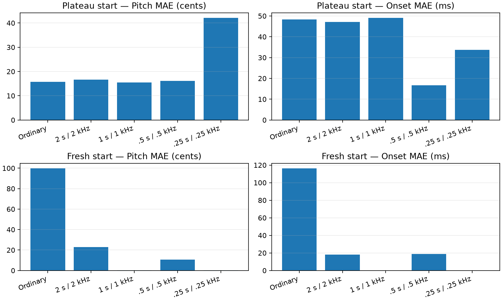
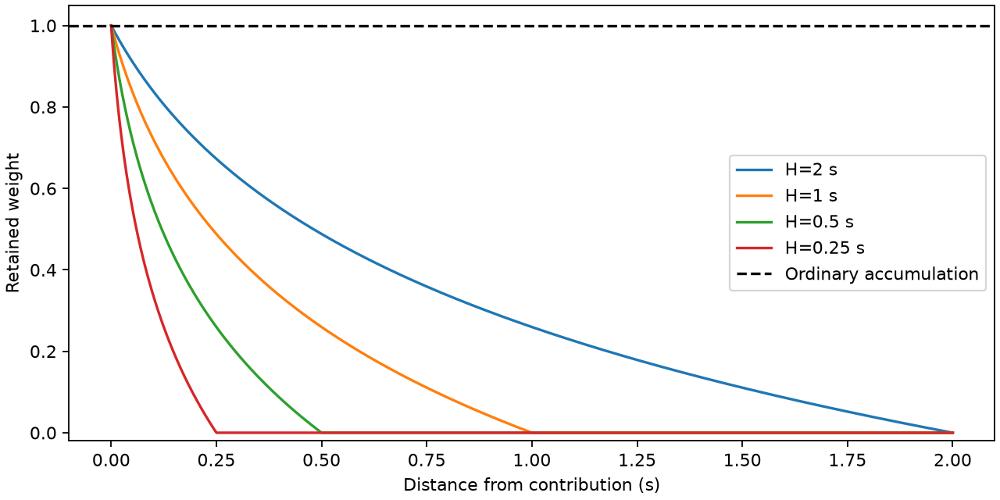

# Logarithmically fading diagonal accumulation

Complete: one frozen eight-event failure, C08-T0000; five objectives × two initial states.

[Protocol](protocol.md) · [Summary CSV](summary.csv) · [Full trajectories](raw-results.json.gz)

Saved plateau: 15.798 cents pitch MAE, 48.300 ms onset MAE.

All fits use all four diagonal directions, fixed amplitudes, no Log-Weighing, the registered Adam/patience schedule and at most 3,000 updates. Fading is applied to each individual contribution along both axes. Each fit selects its best own-objective iterate; target parameter errors never select checkpoints.

| Start | Fade horizon (time / frequency) | Pitch MAE (cents) | Onset MAE (ms) | Joint RMS error | Updates |
|---|---|---:|---:|---:|---:|
| plateau | Ordinary | 15.798 | 48.300 | 0.073773 | 248 |
| plateau | 2 s / 2 kHz | 16.680 | 47.149 | 0.069757 | 314 |
| plateau | 1 s / 1 kHz | 15.500 | 49.044 | 0.071163 | 458 |
| plateau | .5 s / .5 kHz | 16.177 | 16.753 | 0.023801 | 1324 |
| plateau | .25 s / .25 kHz | 42.077 | 33.737 | 0.064272 | 1625 |
| fresh | Ordinary | 99.728 | 116.178 | 0.131327 | 1452 |
| fresh | 2 s / 2 kHz | 22.771 | 18.075 | 0.026122 | 1612 |
| fresh | 1 s / 1 kHz | 0.084 | 0.025 | 0.000054 | 3000 |
| fresh | .5 s / .5 kHz | 10.650 | 18.899 | 0.023130 | 763 |
| fresh | .25 s / .25 kHz | 0.110 | 0.040 | 0.000070 | 1344 |

These are single-case exploratory results, with four predeclared decay scales. Faded training-loss magnitudes are not comparable to the ordinary loss. The CSV also reports the same unfaded diagonal loss and LSD for every selected state. The joint error is the registered RMS matched error. The saved plateau and fresh starts answer different questions; this is not a multi-phrase validation.
