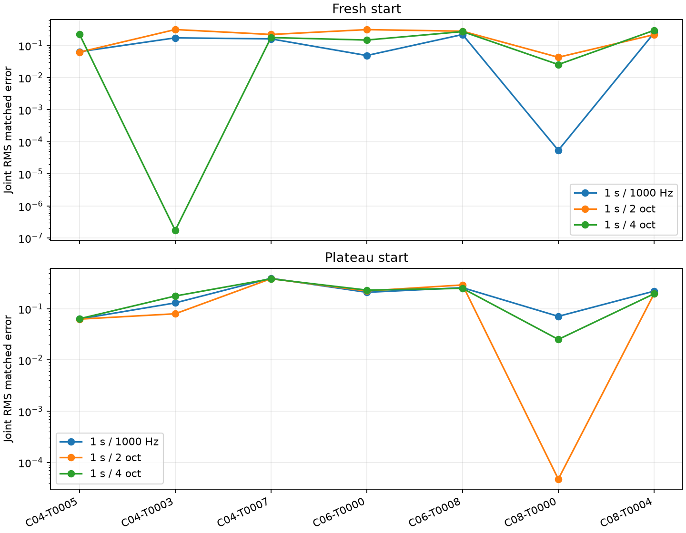

# Fading across seven failed phrases

Complete: 42 fits, three frequency horizons × two starting conditions × seven phrases.

[Protocol](protocol.md) · [Per-phrase metrics](per_phrase.csv) · [Mean/SD/median](summary.csv) · [Paired comparisons](paired.csv) · [Full trajectories](raw-results.json.gz)

All four diagonal directions; 1-second logarithmic fade in time; fixed amplitudes; no Log-Weighing. Same registered Adam/patience and 3000-update cap. Each fit selects its best own-objective iterate. Values below are pitch MAE (cents) / onset MAE (ms).

## Fresh start

| Case | 1 s / 1000 Hz | 1 s / 2 oct | 1 s / 4 oct |
|---|---:|---:|---:|
| C04-T0005 * | 4.265 / 64.500 | 9.122 / 64.021 | 81.019 / 188.461 |
| C04-T0003 | 194.138 / 80.262 | 175.975 / 363.567 | 0.000 / 0.000 |
| C04-T0007 | 203.039 / 7.766 | 268.419 / 4.441 | 214.772 / 7.986 |
| C06-T0000 | 71.745 / 1.308 | 346.333 / 145.840 | 167.982 / 30.598 |
| C06-T0008 | 95.987 / 201.028 | 291.537 / 177.375 | 250.724 / 179.564 |
| C08-T0000 * | 0.084 / 0.025 | 19.775 / 51.410 | 11.598 / 20.764 |
| C08-T0004 | 199.105 / 303.192 | 235.979 / 147.776 | 237.721 / 323.517 |

## Plateau start

| Case | 1 s / 1000 Hz | 1 s / 2 oct | 1 s / 4 oct |
|---|---:|---:|---:|
| C04-T0005 * | 3.214 / 64.450 | 3.548 / 65.322 | 7.619 / 65.956 |
| C04-T0003 | 130.891 / 86.638 | 28.480 / 88.942 | 212.699 / 78.423 |
| C04-T0007 | 475.483 / 143.756 | 476.302 / 147.021 | 482.430 / 145.811 |
| C06-T0000 | 184.289 / 119.552 | 204.579 / 111.733 | 220.683 / 118.139 |
| C06-T0008 | 334.465 / 220.172 | 318.595 / 249.965 | 309.242 / 215.135 |
| C08-T0000 * | 15.500 / 49.044 | 0.057 / 0.029 | 20.187 / 18.470 |
| C08-T0004 | 155.902 / 175.049 | 132.895 / 170.342 | 109.626 / 170.846 |

* C04-T0005 is the original development case; C08-T0000 was used to explore fading. Separate summaries exclude these two and retain the other five failures. The seven-case set is selected for failure, not representative of all targets.

## Recovery counts

Both pitch MAE <1 cent and onset MAE <1 ms.

| Set | Start | 1000 Hz | 2 oct | 4 oct |
|---|---|---:|---:|---:|
| all_seven | fresh | 1 | 0 | 1 |
| all_seven | plateau | 0 | 1 | 0 |
| other_five | fresh | 0 | 0 | 1 |
| other_five | plateau | 0 | 0 | 0 |

Checkpoint selection never uses parameter errors. Raw training losses differ between kernels; compare matched errors, common unfaded diagonal loss and LSD. Actual update counts differ because the same patience rule may stop at different times. One trajectory per setting; results are exploratory, with no multi-seed robustness claim.
