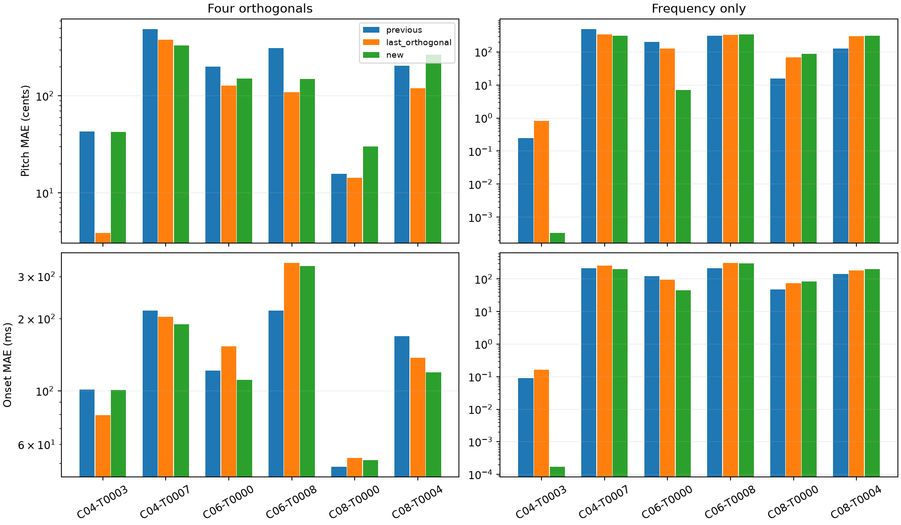

# Diagonal refinement from the last orthogonal iterate

Follow-up to [the six-phrase switch experiment](../orthogonal-validation/README.md).
The previous procedure selected the **best original diagonal-loss checkpoint**
from the orthogonal phase, then refined that checkpoint. This experiment instead
starts from the **actual final orthogonal iterate at update 1600**, even if its
diagonal loss is worse than the original stalled state or an earlier iterate.

Test both variants (four orthogonals and frequency-only) on all six additional
phrases, with no new selection of cases or exploration reruns. Use the exact
saved final pitches and independent onsets. Amplitudes remain fixed at 0.8,
padding at 2.048, and the objective switches completely back to the four-direction
diagonal CeL. Start fresh Adam with the same registered settings as the earlier
refinement: LR .05, objective divided by its initial value, maximum 3000 updates,
plateau patience 100 and stop patience 250. Optimiser moments are reset;
this continues the final **parameters**, not the old orthogonal Adam moments.

Retain the best diagonal loss encountered within this new refinement only.
There is no fallback to the original stalled fit or earlier orthogonal
checkpoints. Compare the last orthogonal state, its new diagonal refinement,
and the previous best-checkpoint refinement. Target parameter errors never
select controls. Report both improvements and regressions relative to the
previous procedure, and retain exact update counts. Maximum refinement budgets
match, but actual early-stopping lengths can differ. The previous diagonal-only
controls are contextual references and are not newly budget-matched to these
runs; this is a restart-state diagnostic, not a fresh compute-matched benchmark.

Implementation: `python scripts/refine_last_orthogonal.py --indices 0 1 2 3 4 5`.
Raw outputs include full refinement trajectories, starting controls, source-file
SHA256, target/renderer/optimizer provenance and previous results. Verify the
starting diagonal loss against the saved update-1600 loss within 1e-12 and verify
fixed amplitudes throughout. Production code and the paper are unchanged.

## Results

Returning from the final orthogonal state **does yield further improvements on
some phrases**, but it also causes regressions relative to the previous
best-checkpoint refinement. Frequency-only has three >20% improvements in joint
event error and three >20% regressions. Four orthogonals have one >20% improvement,
one smaller improvement, and four regressions. No additional phrase meets the
strict recovery threshold (<1 cent AND <1 ms); the already recovered four-event
phrase becomes substantially more accurate.

Frequency-only results, previous refinement -> final-iterate refinement:

| Case | Previous pitch / onset MAE | New pitch / onset MAE | Interpretation |
|---|---:|---:|---|
| C04-T0003 | 0.246 cents / 0.089 ms | 0.000337 cents / 0.000168 ms | Much more precise recovery |
| C04-T0007 | 489.887 cents / 216.169 ms | 311.251 cents / 202.340 ms | Partial improvement |
| C06-T0000 | 201.539 cents / 121.817 ms | 6.981 cents / 45.548 ms | Large pitch improvement; timing still wrong |
| C06-T0008 | 310.860 cents / 216.151 ms | 340.726 cents / 304.727 ms | Worse |
| C08-T0000 | 15.798 cents / 48.300 ms | 87.340 cents / 84.198 ms | Worse |
| C08-T0004 | 124.953 cents / 141.262 ms | 310.369 cents / 201.626 ms | Worse at the 3000-update cap |

For four orthogonals, C04-T0007 improves from 489.887 cents / 216.169 ms to
332.561 cents / 190.010 ms. C06-T0000 improves more modestly to 151.322 cents /
111.225 ms. Other cases worsen in normalized joint event error; individual
pitch and onset MAEs sometimes move in opposite directions.

The frequency-only median joint-error change is a **3.51% increase** versus the
previous procedure; four orthogonals have a **4.11% increase**. Thus the last
iterate is not generally preferable. However, on C06-T0000 the earlier rule
retained the original stalled checkpoint, whereas refining the final orthogonal
state reduces diagonal loss from the previous result's 0.00724561 to 0.00176391.
The final orthogonal state had loss 0.02355424 before refinement. Rejecting it
before trying diagonal refinement therefore missed this route to improvement.

A practical implication is to preserve the incumbent, refine the final
orthogonal state, and only then compare their diagonal losses. Retrospectively,
all three improved frequency-only results have lower diagonal loss than their
previous results, and all three regressions have higher diagonal loss. This
suggests a safeguard on these cases, not a general guarantee that lower loss
means better recovered parameters. The runs here deliberately kept every new
result so regressions remain visible; they did not implement an adoption gate.

Actual refinement lengths differ despite identical maximum budgets and stopping
rules. The near-exact C04-T0003 frequency-only fit takes 2012 updates versus 248
previously, and C06-T0000 takes 1233 versus 248. C08-T0004 frequency-only hits the
3000-update limit and is not claimed converged. Do not interpret these as
exactly matched final-compute comparisons. The saved starting states and prior
results make the change in restart policy explicit.

[All twelve comparisons](table.md), [refinement budgets](costs.md),
[exact metrics](summary.csv), [aggregate results](aggregate.json),
[raw trajectories, starting controls and provenance](raw-results.zip).

Validation passed for all twelve runs: source SHA256s match; first refinement
controls reproduce the last orthogonal controls within 1e-10 and diagonal loss
within 1e-12; trajectories remain finite with amplitudes fixed at 0.8; and saved
best losses equal trajectory minima. Both experiment/report scripts pass Ruff.
Recreate the report with `python scripts/report_last_orthogonal.py`.

