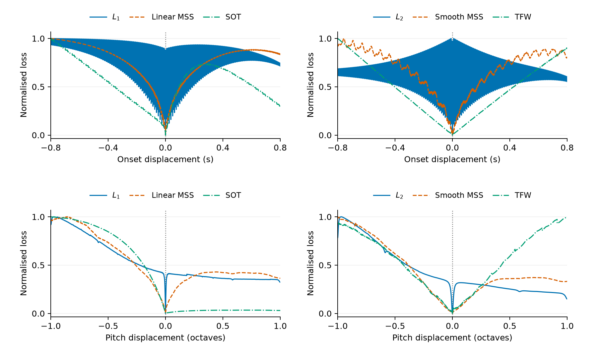
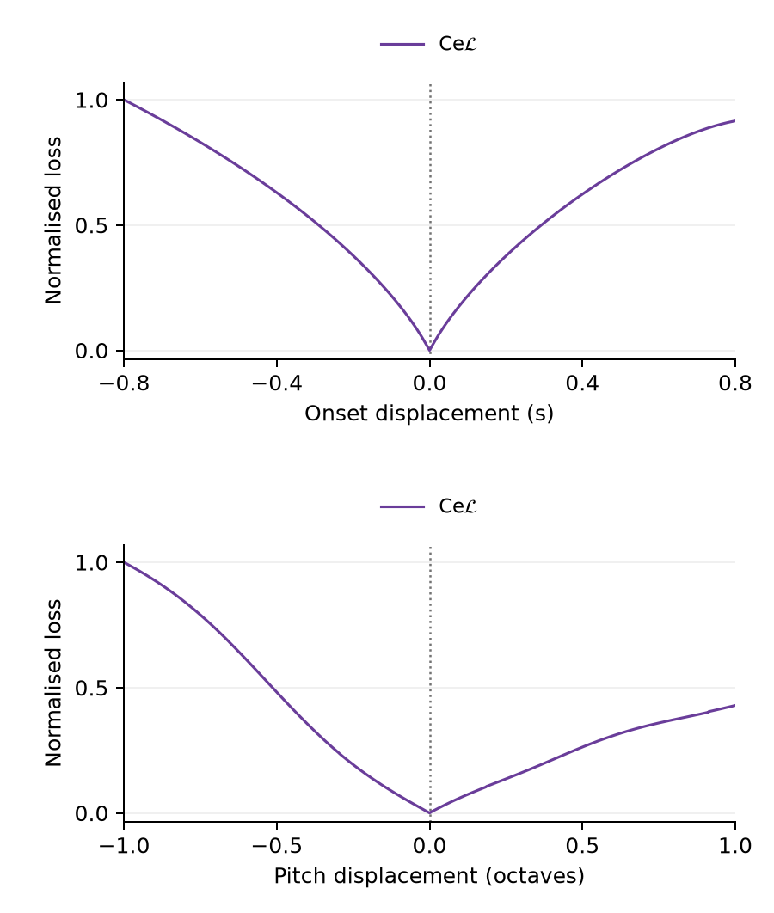

# Single-event loss sweeps

## Revised layout comparison

- **Five spectral losses, one column:** [PNG](comparison-spectral-column.png) · [PDF](comparison-spectral-column.pdf). All five curves share each panel; onset above pitch.

- **Seven losses:** [PNG](comparison-seven.png) · [PDF](comparison-seven.pdf). Left: L1, Linear MSS, Smooth MSS. Right: L2, SOT, TFW, CeL.
- **Five spectral losses:** [PNG](comparison-spectral.png) · [PDF](comparison-spectral.pdf). Left: Linear MSS, Smooth MSS. Right: SOT, TFW, CeL.

Both revisions use the exact saved values and normalisation below, with no smoothing or downsampling. Each loss has its own colour, consistent across both rows and versions. Waveform curves are thin dark lines behind the spectral curves (0.45 pt, opacity 0.65); spectral curves are 1.3 pt. The original figures remain available below. [Rendering provenance](layouts.provenance.json).

Reproduce only these layouts, without recomputing losses:

```bash
PYTHONHOME="$PWD/.pixi/envs/default" OPENBLAS_NUM_THREADS=1 \
  .pixi/envs/default/bin/python scripts/render_loss_sweep_layouts.py
```

## Original review figures

Review figures for deciding the gradient experiment and its presentation. The manuscript figures have not been replaced.

- [Six-loss comparison (PDF)](comparison.pdf): left column waveform L1, Linear MSS and SOT; right column waveform L2, Smooth MSS and TFW.
- [Four-direction CeL (PDF)](cel.pdf): separate figure with the same two sweeps.
- [Raw values (CSV)](sweeps.csv), [raw and normalised arrays (NPZ)](raw-sweeps.npz), [provenance and checks](provenance.json).





## Protocol

The target is the existing single pluck at 160 Hz and 1.0 s, with fixed amplitude 0.8. Target and candidate use the same renderer, CPU float64, compiled TorchLPC and 2.048 onset padding (FFT length 16384 for 8000 samples).

The upper row varies onset displacement from −0.8 to +0.8 seconds with pitch fixed at 160 Hz. The lower row varies pitch displacement from −1 to +1 octave (80–320 Hz) with onset fixed at 1.0 s. Each sweep has 3201 equally spaced points, including the exact target marked by the vertical dotted line. No optimisation is performed.

Each loss curve is independently min–max normalised within its sweep. This preserves extrema and the sign of slopes, but does **not** compare absolute loss values or gradient magnitudes. No smoothing is applied. These conditional one-event slices do not demonstrate behaviour under simultaneous pitch and onset errors or multi-event recovery.

Linear MSS is the standalone linear-magnitude term from the existing SOT composite, without the 0.05 coefficient: periodic Hann windows 512/256/128/64/32/16 with quarter-window hops, summing mean absolute magnitude differences. Smooth MSS retains its existing flat-top windows, log1p magnitudes and squared differences. SOT denotes the existing published asymmetric transport **plus** 0.05 Linear MSS, not pure transport. TFW uses the published linear-frequency coordinates, with 1 second equivalent to 1000 Hz. CeL averages all four diagonal directions, with square-root features and neither Log-Weigh nor Fade.

## Verification and reproduction

The generator checks standalone Linear MSS against the existing composite minus its transport component on three probe signals, checks self-comparison for all seven losses, and requires finite, nonnegative sweep values and a target residual below 1e-8 of each curve's range. Exact self-comparisons are also required below 1e-10 in raw units. Batched synthesis can differ from the individual target render at floating-point precision; quantile transport can amplify this into a small nonzero raw cost, so the sweep check is relative to the plotted range. Raw residuals are retained in provenance.

```bash
PYTHONHOME="$PWD/.pixi/envs/default" OMP_NUM_THREADS=1 OPENBLAS_NUM_THREADS=1 \
  .pixi/envs/default/bin/python scripts/render_loss_sweeps.py
```

The script is isolated from shared experiment source files so that earlier fit signatures remain unchanged.
