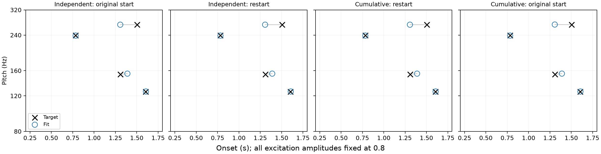
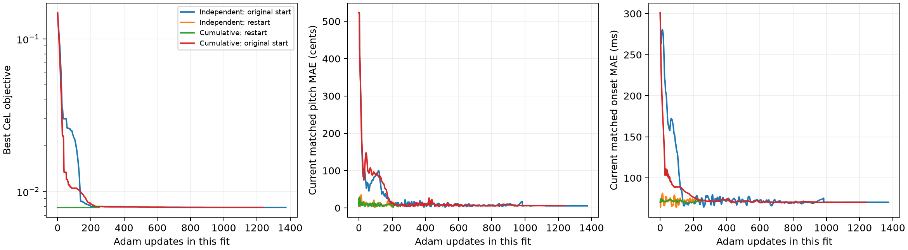

# Cumulative onset-gap pilot, fixed excitation amplitude

Follow-up to the [amplitude pilot](../amplitude-pilot/README.md), requested
2026-09-16: test chronological onsets formed by cumulative positive increments
on the same failed four-event target C04-T0005 (UI target 6). **All excitation
amplitudes remain fixed at 0.8; amplitudes are not learned.**

## Parameterisation

For four free gap logits z, form five positive gaps:

`g = 1.6 * softmax([z1, z2, z3, z4, 0])`

The onsets are `0.2 + g1`, `0.2 + g1 + g2`, and so on. The fifth gap is
unused terminal slack, keeping the fourth onset below 1.8 s. Thus event 1
occurs at t1 and event i occurs at t1 plus the subsequent positive increments.
This is a bounded version of the requested cumulative-time parameterisation,
with four free timing parameters, strict chronological order, no clipping and
no minimum inter-event spacing. Gap normalisation couples the timing controls.
Pitch uses the same independent bounded log-frequency logits as before.

The two new fits start (1) at the previous fixed-amplitude baseline's strict-best
swapped controls and (2) at the registered equal-cell initialisation. Both use
four-direction unweighted square-root CeL (implementation name
`bidirectional_cumulative_energy`), FFT length 16384 for 8000 samples (2.048),
float64 CPU synthesis, and the registered Adam schedule: initial LR 0.05,
initial-loss conditioning, rollback/reduced LR on plateaus and at most 3000
updates. Each run starts with fresh moments. No LR tuning is performed for
the new coordinate system.

The [previous fixed restart](../amplitude-pilot/restart_fixed.json) and
[original baseline](../amplitude-pilot/baseline.json) are the independent-time
controls; their stored results are reused, not rerun. New fits check that the
initial physical loss matches the respective control to absolute 1e-12 and
that onsets stay ordered and amplitudes stay 0.8 at every evaluation. Coordinates
are encoded to reproduce the same initial pitches and times.

Validation checks coordinate round trips, the coordinate Jacobian by finite
differences, and the rendered-loss chain rule. The prior amplitude-pilot
verification also checks that the shared experimental fitter still reproduces
the production fixed-amplitude audio, gradients and initial Adam trajectory.
Production experiment code and paper text are unchanged.

Run with the project Python and PYTHONHOME set to `.pixi/envs/default`:

```
python scripts/test_ordered_recovery.py --verify
python scripts/test_ordered_recovery.py
```

## Results

Both runs completed, stopping by the registered patience rule. Every evaluated
state had strictly ordered onsets and excitation amplitudes exactly 0.8. Both
initial losses matched the corresponding independent-time controls to 1e-12.

| Condition | Updates | Best CeL | Matched pitch MAE (cents) | Matched onset MAE (ms) |
|---|---:|---:|---:|---:|
| Independent, original start | 1374 | 0.0078786668 | 5.481 | 70.452 |
| Independent, restart | 248 | 0.0078786668 | 5.481 | 70.452 |
| Cumulative, restart | 248 | 0.0078786668 | 5.481 | 70.452 |
| Cumulative, original start | 1240 | 0.0078778416 | 6.249 | 70.352 |

The cumulative restart's strict-best state is its starting configuration, up
to coordinate round-trip rounding. From the original start, cumulative timing
converges to almost the same swap: **270.70 Hz at 1.30689 s, followed by
154.61 Hz at 1.39022 s**. The target instead has **153.41 Hz at 1.30964 s,
followed by 270.20 Hz at 1.50589 s**. The small difference in final loss is
not meaningful evidence of recovery.

Small matched pitch errors should not be read as correct temporal association:
Hungarian assignment pairs the swapped pitches with targets at different times.
The additional chronological-pairing metric in `diagnostics.json` makes this
failure explicit.

**Conclusion:** cumulative positive onset gaps, with fixed amplitudes and the
same Adam hyperparameters, do not fix this case. Ordering ensures chronological
parameter slots; it does not ensure that the right pitch occupies each slot.
Changing coordinates can change the optimisation path but does not by itself
remove a bad local minimum within the ordered region. Here the observed fits
remain in the wrong configuration; this diagnostic does not prove that the
numerical endpoint is an exact stationary point.

This result concerns this bounded gap parameterisation, this optimiser and this
selected target. It does not establish that all ordered-time parameterisations
or tuned learning rates behave identically, or replace the full recovery study.



Black crosses are targets, blue circles are fitted events. Grey lines show the
paper's joint Hungarian pairing. All excitation amplitudes are fixed at 0.8.



The loss panel shows best-so-far values; the error panels show current evaluated
states. Update counts start at zero for each run, including restarts.

Artifacts: [table](table.md), [diagnostics](diagnostics.json),
[provenance](provenance.json), [cumulative restart](ordered_restart.json),
[cumulative original start](ordered_initial.json). Full evaluated trajectories
are retained. Recreate the plots with `python scripts/report_ordered_recovery.py`.

