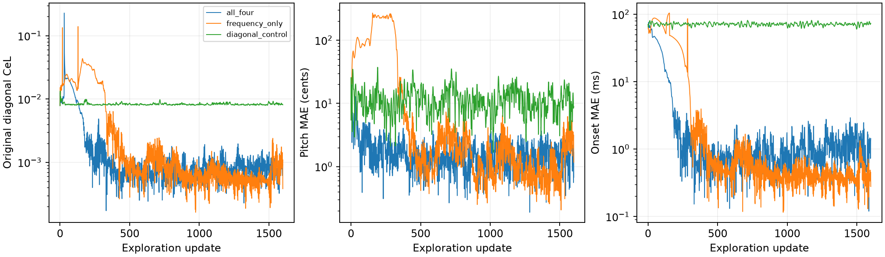

# Axis-only cumulative losses after a diagonal plateau

Requested 2026-09-16. Test C04-T0005 from the strict-best stalled controls in
[the amplitude pilot](../amplitude-pilot/baseline.json). No pitch swaps,
amplitude learning, onset ordering, or Log-Weighing. Padding remains 16384/8000
= 2.048. This is a selected-case escape diagnostic, not a population benchmark.

For STFT power P[k,n], the four new surfaces are:

- Up: sum over i <= k of P[i,n], independently in each frame n.
- Down: sum over i >= k of P[i,n], independently in each frame n.
- Right: sum over j <= n of P[k,j], independently in each frequency bin k.
- Left: sum over j >= n of P[k,j], independently in each frequency bin k.

Use the same STFT as the diagonal CeL (256-sample Hann, hop 64, center=False),
total target STFT power m, feature sqrt(max(S/m, 1e-12)), and RMS feature error.
Each surface uses the same global m, with no per-frame or per-bin mass
normalisation. Average either all four axis-only RMSs or only up/down. The
control averages the original four diagonal RMSs. Time-only accumulation is
along the entire row, not just the immediately adjacent frame. Frequency-only
accumulation leaves frames separate, but the synthesiser still couples pitch
and onset gradients; this does not constrain updates to pitch alone.

All three restart from identical stalled controls with fresh Adam, LR .05,
betas (.9,.999), epsilon 1e-8. Divide each objective by its own initial value.
Run 1600 updates without rollback or LR reduction. Record every iterate and
allow increases in the diagonal loss. Keep the strict-best **original diagonal
CeL** checkpoint (including the initial state), then refine it with the original
CeL and registered Adam schedule (maximum 3000 updates, plateau patience 100,
stop patience 250). No ground-truth parameter errors enter checkpoint selection.
Exploration budgets match; refinement lengths may differ and are reported.

The switch is triggered manually at the previously established plateau; this
experiment does not implement a general automatic stall detector or recurring
rotation schedule. It tests replacing the diagonals by the specified axis-only
objective for one exploration phase, then returning to diagonals.

Validation checks inclusive axis sums against an asymmetric toy grid, zero
self-distance, finite optimisation gradients, and reproduction of the archived
starting diagonal loss to 1e-12. Production objectives and paper are unchanged.

Run `python scripts/test_orthogonal_directions.py VARIANT`, with VARIANT one of
`all_four`, `frequency_only`, `diagonal_control`, in the project environment.
Run `python scripts/report_orthogonal_directions.py` to reproduce the report.

## Results

Both axis-only variants escape this selected failure. The frequency-only
restart followed by diagonal refinement recovers the target to 0.000286 cents
pitch MAE and 0.000060 ms onset MAE (diagonal CeL 1.03482e-7). All four axis-only
directions finish at 1.154383 cents and 0.152674 ms (CeL 0.000172409), compared
with the starting 5.481 cents and 70.452 ms (CeL 0.007878667).

The first >1% improvement in the original diagonal loss occurs at exploration
update 136 for all four axes and 326 for frequency-only. Their selected
exploration checkpoints occur at updates 331 and 974, respectively. Diagonal
refinement takes 248 and 1695 further updates, respectively. Thus the matched
1600-update exploration establishes escape before the unequal refinement
budgets; the near-exact final recovery additionally uses more refinement.

Frequency-only accumulation does **not** mean pitch-only optimisation. At the
initial state its unscaled raw-logit pitch-gradient norm is 0.000798 while its
onset-gradient norm is 0.050387. It can strongly adjust timing to reduce
within-frame spectral mismatch. For all four axes these norms are 0.013383 and
0.020627. These are gradients in bounded-control logits, not physical units,
and their magnitudes alone do not establish movement toward the target.

This supports the proposed axis-only escape mechanism on the development case.
It does not establish reliability across failed phrases, which axis subset is
best generally, or an automatic switching/patience rule. The experiment uses
an abrupt objective switch, not a gradual rotation or alternating individual
axis directions. There is no pitch reassignment or parallel swap.

[Final metrics](table.md). Full per-update controls, losses, matched errors and
refinement trajectories: [all four axes](all_four.json),
[frequency only](frequency_only.json), [diagonal control](diagonal_control.json).

The diagonal-only control never improves on the starting checkpoint and remains
at 5.480767 cents / 70.452117 ms after 1600 exploration updates plus 248
refinement updates. Total descent updates are 1848 (all four axes), 3295
(frequency-only), and 1848 (control); this is not an exactly matched total-compute
comparison of the final refined errors.

## Continuous interpolation versus all eight directions

Follow-up: restart the same stalled C04-T0005 controls, keeping amplitudes fixed
and independent onset logits. Let D be the mean of the original four diagonal
RMS terms and O the mean of the four axis-only RMS terms defined above.

- `interpolating`: L(s) = (1-a(s)) D + a(s) O, where
  a(s) = 1 - |2 ((s mod 800)/800) - 1|. Each cycle starts at pure diagonal,
  reaches pure orthogonal after 400 updates, and returns after 800. Run two
  cycles (1600 updates). This is continuous piecewise-linear interpolation
  between loss families, not a geometric rotation of the cumulative operator.
- `eight_directions`: L = (D+O)/2 throughout. Since both families contain four
  directions, every directional RMS has weight 1/8.

Both new runs divide their mixed objective by the **same starting diagonal
loss**, held fixed throughout, and use identical fresh Adam settings and
budgets. Neither loss family is individually standardised: equal coefficients
need not imply equal gradient contributions. Keep strict-best diagonal-loss
checkpoints, including the initial state, and apply the same diagonal refinement
as before. Ground-truth errors never select checkpoints. Validate the triangular
schedule at endpoints and midpoints and reconstruct each saved mixed loss from
its component losses to tolerance 1e-12. Run the two variants concurrently.
