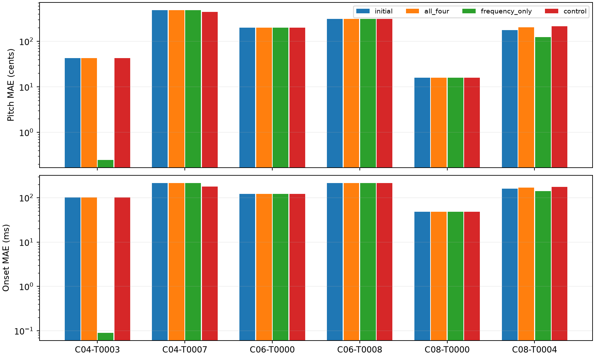

# Switching stalled diagonal CeL fits to axis-only accumulation

Prespecified follow-up to the successful [four-event development case](../orthogonal-escape-pilot/README.md).
Reuse the **same six additional failed phrases** selected for the
[takeover experiment](../takeover-validation/cases.json): two each with 4, 6,
and 8 events. These are selected failures, not a representative success-rate
sample. Do not replace any case based on its switch outcome.

Use the saved fresh 2.048-padding baseline fits from that experiment. Each
terminated at patience 250 with amplitudes fixed at 0.8. Re-render and verify
its strict-best diagonal loss within 1e-12 before switching. Preserve the
baseline trajectory, renderer provenance and initial metrics in the raw archive.
This implements one switch after a previously established stall, not repeated
automatic switching during fitting.

For each baseline, run two independent restarts:

1. All four axis-only cumulative directions (up, down, right, left).
2. Frequency-only accumulation (up and down, independently in each frame).

Use the identical STFT, global target-power normalisation, square-root features
and directional RMS average as the development pilot. Keep independent bounded
pitch/onset logits and fixed amplitudes. There is no Log-Weighing or pitch swap.
Start fresh Adam at LR .05 and run 1600 exploration updates, dividing by each
restart's initial objective value. Permit uphill diagonal steps, but save the
strict-best original diagonal-loss checkpoint including the starting state.
Then refine that checkpoint using diagonal CeL and the registered Adam schedule
(maximum 3000 updates, plateau patience 100, stop patience 250). Parameter errors
are diagnostic only and never choose checkpoints.

A shared diagonal-only control gets **the larger of the two total switch
budgets**, including exploration and refinement. It repeatedly applies ordinary
canonical descent with the registered patience/LR policy, restarting from the
best controls with fresh moments and LR .05 when patience is exhausted, until
that exact budget is spent. Thus each switch receives no more gradient updates
than its control; the smaller-budget switch may receive fewer. Forward counts
and wall time are not exactly matched. This control is distinct from the
fixed-LR exploration control used in the single-case development pilot.

Primary diagnostic: jointly matched pitch/onset errors and normalized joint
event error relative to the control. Also report canonical loss and relative
waveform L2. Lower loss alone does not establish parameter recovery. Define
strict recovery as pitch MAE <1 cent AND onset MAE <1 ms, and report both
improvements and regressions; do not select the better variant per phrase as
if it were an implementable policy.

Implementation: `scripts/test_orthogonal_directions.py --case-index INDEX VARIANT`
and `scripts/validate_orthogonal_cases.py --index INDEX`. Six indices are 0–5 in
the previously frozen case list. Production fitting code and paper are unchanged.

## Results

Frequency-only switching produces **one strict recovery and one partial gain**
among the six additional selected failures. Four-orthogonal switching produces
no strict recovery. Both variants have a median joint-error improvement of 0%
relative to the diagonal control.

- **C04-T0003:** frequency-only reduces pitch/onset MAE from 42.875 cents /
  101.271 ms to **0.246 cents / 0.089 ms**. The equal-budget diagonal control
  remains at the baseline. Joint event error falls 99.83% versus control.
- **C08-T0004:** frequency-only reduces errors from 178.123 cents / 159.583 ms
  to **124.953 cents / 141.262 ms**. The control reaches 215.378 cents /
  175.182 ms. Joint error falls 25.25% versus control, but the phrase remains
  substantially wrong. Four orthogonals finish at 204.918 cents / 169.301 ms:
  worse than baseline on both MAEs, although joint error is 9.62% below control.
- **C04-T0007:** both switches retain the baseline (489.887 cents / 216.169 ms),
  while ordinary diagonal continuation improves to 441.778 cents / 178.089 ms.
  Switch joint error is 13.71% higher than control.
- **C06-T0000, C06-T0008, C08-T0000:** both switches and control retain the same
  stalled solution. Neither six-event phrase improves.

Thus frequency-only switching helps some additional failures, but the original
successful development case did not establish a reliable general rescue rule.
Do not interpret these selected cases as a population success rate. There is
no evidence here for preferring four orthogonals over frequency-only. Also,
retaining a lower canonical loss does not guarantee better pitch/onset errors;
C08-T0004 explicitly demonstrates that distinction.

All runs use 1848 extra updates except C08-T0004: 2215 for four orthogonals and
3819 for frequency-only and its shared control. Thus the frequency-only results
are exactly matched in backward-update count to control on all six cases;
four orthogonals receive fewer updates on the final case. These counts exclude
the shared baseline fitting cost. Controls and both variants keep amplitudes
fixed and use no target-coordinate-based checkpoint selection.

[Full pitch/onset table](table.md), [exact metrics CSV](summary.csv),
[update budgets](costs.md), [aggregate comparison](aggregate.json),
[all raw trajectories and baseline provenance](raw-results.zip).

Validation passed for all twelve switch runs: 1601 finite exploration records,
correct strict-best canonical checkpoints, fixed amplitudes, starting-loss
reproduction within 1e-12, and control budgets at least as large as each switch.
Axis isolation and self-distance checks run in every switch process. Ruff passes
for the three experiment/report scripts. All six cases completed locally;
the pending Slurm array was cancelled without running. Recreate the report with
`python scripts/report_orthogonal_validation.py`.

