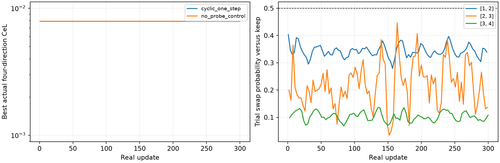

# Isolated pitch-assignment lookahead

User proposal, 2026-09-16: cycle adjacent pitch swaps, refine a trial copy,
render again, and use its score to inform assignment without injecting trial
gradients or trial parameter updates into the real fit. Amplitudes remain 0.8.

Independent per-event softmax rows cannot enforce one-to-one assignment. Each
candidate here is a complete permutation. Softmax scores compare two complete
assignments (keep versus adjacent swap); a real render must choose one hard
permutation, not average pitches or waveforms. Trial optimisers are cloned.

The first diagnostic tests swaps 1↔2, 2↔3 and 3↔4, plus keep, at depths 1,5,20.
It starts both at the stored plateau and after one real Adam step. Trial branches
use the same cloned moments, step count, LR .05, fixed original-loss conditioning
and independent pitch/onset logits. It records three different criteria:

1. Improvement relative to the swapped trial's own starting loss.
2. Improvement over an equally refined unswapped trial.
3. Improvement over the live fit before the trial.

Only the latter two indicate that a trial is better than keeping the assignment.
Each probe verifies exact equality of live parameters, Adam moments and step count
before/after the trial, and that live `.grad` buffers remain unset. A diagnostic
keep/swap softmax uses negative post-trial losses with temperature equal to the
original baseline loss; this is not a tuned assignment learning rule.

Previously saved fits already show that swapping slots 2 and 3 lowers its own
loss after one step but remains worse than the real fit; it needs 18 steps in
that earlier, separately normalised run to beat the baseline. Scores here use
a common loss scale across trial branches, so the new diagnostic is authoritative
for this formulation. Run `python scripts/test_shadow_swaps.py` with the project
environment. No production fitter or paper changes.

## Cyclic assignment-only pilot

Use 300 real updates cycling proposals 1↔2, 2↔3, 3↔4, then repeat. From the
same pre-update state, compute the normal real Adam step and the swapped trial
Adam step. Score both resulting waveforms. Softmax over their two negative
losses (temperature = baseline loss) compares complete permutations; hard
argmax selects keep or swap. There is no independent softmax per event, pitch
averaging, stochastic sampling, or persistent learned assignment-logit table.
This is a minimal deterministic test of the proposed lookahead mechanism.

Commit only the normal real Adam parameter/moment update and the selected
permutation. Discard the trial update even on acceptance. Measure the actual
post-assignment loss, which may differ from the trial score. Preserve the best
actual canonical checkpoint and polish with the registered fitter. Compare
against 300 identical ordinary Adam steps with no proposals, followed by the
same polish. The exploratory LR is .05 without rollback; both branches use
identical pre-step moments and fixed baseline loss conditioning. All amplitudes
remain .8. This pilot starts from the failed fit, not from target initialisation.

The real update doubles as the equally refined unswapped comparator, so each
proposal adds one backward pass plus its scored forward render. Exact state
checks ensure trial backward cannot alter the real state. A valid permutation
is checked at every iteration. Run `python scripts/test_cyclic_shadow.py`.

## Results

The 300-step cyclic one-step pilot accepted **zero swaps**. Its entire sequence
of 300 actual losses and matched event metrics agrees exactly with the no-probe
control, confirming that discarded trial computations do not affect the real
updates in this run. Both preserve the baseline canonical CeL 0.0078786668 and,
after canonical polish, matched errors 5.480767 cents / 70.452117 ms.

At the original plateau, the useful swap 2↔3 scores:

| Trial depth | Keep after trial | Swap after trial | Swap probability |
|---|---:|---:|---:|
| 1 | 0.01333594 | 0.02146034 | 0.26285 |
| 20 | 0.00871950 | 0.00784032 | 0.52787 |

The unchanged pre-trial fit scores 0.00787867. The ordinary first Adam step
with freshly reset LR .05 overshoots this plateau, which is why the one-step
keep score is worse than the starting fit. All alternatives use identical
pre-trial optimiser state. The 20-step swapped score beats both the equally
refined keep trial and the pre-trial real state. This diagnostic does **not**
test whether committing only that assignment after a 20-step trial would
recover during a live cyclic run. Its temporary refined controls were discarded.

Improvement relative to a swapped trial's own bad starting score is insufficient:
swap 3↔4 also improves its own score after one step without becoming competitive
with keeping the assignment. Scores should account for the alternative rather
than reward any downhill step. A softmax based on these scores changes confidence,
but cannot supply the missing longer-horizon evidence.

**Interpretation:** the isolation mechanism is valid and demonstrably harmless
to the real gradients/state. This minimal one-step hard-choice version does not
resolve the failure. The deeper diagnostic motivates longer isolated rollouts,
but does not establish an improved full algorithm. A persistent learned
assignment policy or stochastic sampling of permutations has not been tested.

Artifacts: [probe scores and isolation checks](probes.json),
[cyclic run](cyclic_one_step.json), [control](no_probe_control.json),
[table](table.md). Recreate the report with `python scripts/report_shadow_swaps.py`.
