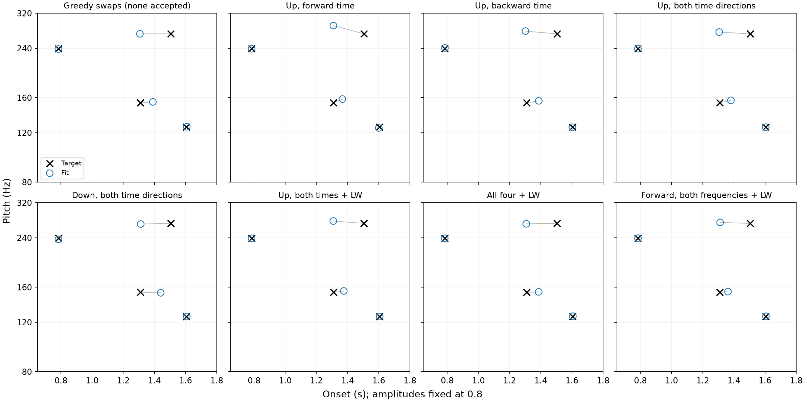
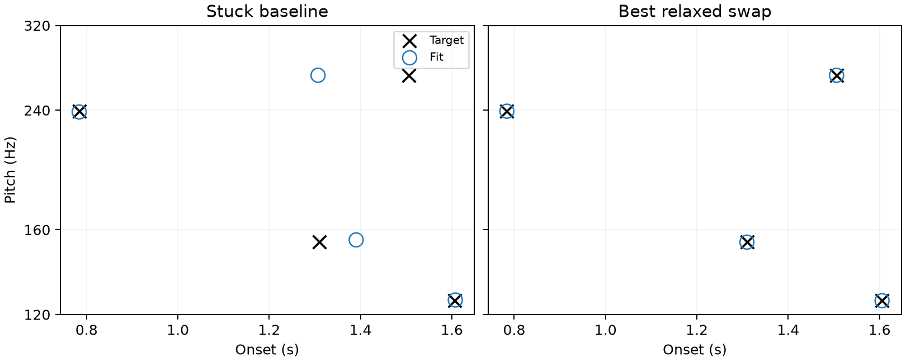

# Escape from a swapped four-event fit

2026-09-16 follow-up to the amplitude and ordered-time pilots. Same target
C04-T0005, same fixed-amplitude failed fit, same 2.048 padding. All amplitudes
remain 0.8 and times use independent bounded logits. No production/paper change.

Seven loss restarts test upward frequency accumulation (bottom to top) in
forward time (↗, cel_01), backward time (↖, cel_04), both time directions
(↗↖, cel_05), and the latter with Log-Weighing (cel_05_lw). Comparators are
downward frequency in both time directions (↘↙, cel_10), all four with
Log-Weighing (cel_15_lw), and forward time in both frequency directions with
Log-Weighing (↗↘, cel_03_lw). This is a selected subset, not a full ranking.

All restart at identical failed physical controls with fresh Adam moments,
the registered initial LR 0.05 and rollback/stop schedule, at most 3000 updates.
Each objective conditions by its own initial loss. Comparisons use matched
pitch/onset errors and the original canonical four-direction CeL evaluated
at each run's strict-best state; different objectives' raw values are not
compared directly. Retain all evaluated trajectories and all tried variants.

An additional intervention holds onsets fixed, scores all six pairwise swaps
of the four current pitches plus the unchanged candidate using canonical CeL,
and chooses the minimum. Target coordinates are not used for proposal selection;
only target audio through the same objective. Resume canonical CeL Adam from
that candidate. This is an extra discrete search step, not pure gradient descent,
and uses six extra proposal evaluations beyond the unchanged candidate.

Shared experimental fitter was checked against production and used by both
preceding pilots. Direction implementations were validated in the completed
[direction screen](../cel-gradient-screen/README.md). The runner asserts fixed
amplitudes at every evaluation. Run `python scripts/test_swap_escape.py` with
the project environment and PYTHONHOME set to `.pixi/envs/default`.

## Fixed-direction restarts

| Intervention | Updates | Canonical CeL at best | Pitch MAE (cents) | Onset MAE (ms) |
|---|---:|---:|---:|---:|
| Unchanged baseline | — | 0.0078786668 | 5.481 | 70.452 |
| Greedy swaps (none accepted) | 248 | 0.0078786668 | 5.481 | 70.452 |
| Up, forward time | 542 | 0.0087424258 | 46.016 | 64.967 |
| Up, backward time | 281 | 0.0081953183 | 20.068 | 71.195 |
| Up, both time directions | 413 | 0.0080269693 | 16.227 | 68.150 |
| Down, both time directions | 862 | 0.010006602 | 7.910 | 81.621 |
| Up, both times + LW | 502 | 0.0080770177 | 13.567 | 66.047 |
| All four + LW | 303 | 0.0079182325 | 5.056 | 69.432 |
| Forward, both frequencies + LW | 385 | 0.008545074 | 6.922 | 61.658 |

All seven directional/weighted restarts retain the swapped association; none
recovers this target. Canonical CeL at the selected state is worse than the
starting baseline for every changed objective. Raw losses of different
objectives are not comparable. The greedy pitch-swap screen selects the
unchanged state because all six immediate swaps increase the loss.

The first panel is the greedy proposal test, which selected no swap. Crosses
are target events, circles are fits and lines show the joint Hungarian pairing.
Full JSON trajectories, [proposal scores](swap_proposals.json), and
[provenance](provenance.json) retain every attempted run. Recreate the report
with `python scripts/report_swap_escape.py`.

The user's subsequent idea of gradually rotating weights **after a plateau**
is tested separately with a matched uniform-weight control in the
[rotation pilot](rotation/README.md). Fixed-direction restarts do not test that
schedule, and failure here does not establish failure of adaptive weighting.

## Adaptive follow-up: relax before judging a swap

The greedy proposal screen selected the unchanged state: all six swaps initially
increase CeL. Therefore also optimise **all six** swapped candidates under canonical
CeL before selecting by their final strict-best losses (including the unchanged
baseline in selection). Same full registered schedule, fixed amplitudes and
independent times. This is a six-restart search with more compute, explicitly
not an equal-budget loss comparison. Enumeration is lexicographic; no target
coordinates select a proposal. Each trajectory is stored under `relaxed-swaps/`.
Run `python scripts/test_relaxed_swaps.py` in the same environment.

## Relaxed swap results

**Optimising after the swap recovers this case.** Of all six pairwise proposals,
slots 2 and 3 produce the lowest final canonical loss. Selection uses only that
loss, not the target event coordinates. It initially increases CeL from
0.00787867 to 0.0228532, so a greedy acceptance rule would reject it. After
refinement, CeL is **1.36884e-7**, matched pitch MAE **0.000363 cents**, and
matched onset MAE **0.000128 ms**, with the correct temporal pitch association.
The other five proposals do not recover this case. Amplitudes stay fixed at 0.8.

This supports an explicit assignment-search escape step on a plateau, allowing
a temporarily worse objective while each proposal is refined. It adds discrete
search and six optimiser runs; it is not a pure gradient method or evidence
that this extra compute will help all targets. A cheaper shortlist/short-budget
version remains untested.

[All six results](relaxed-swaps/table.md), [loss-based selection](relaxed-swaps/selection.json),
and the raw trajectories are retained. Recreate the summary with
`python scripts/report_relaxed_swaps.py`.

