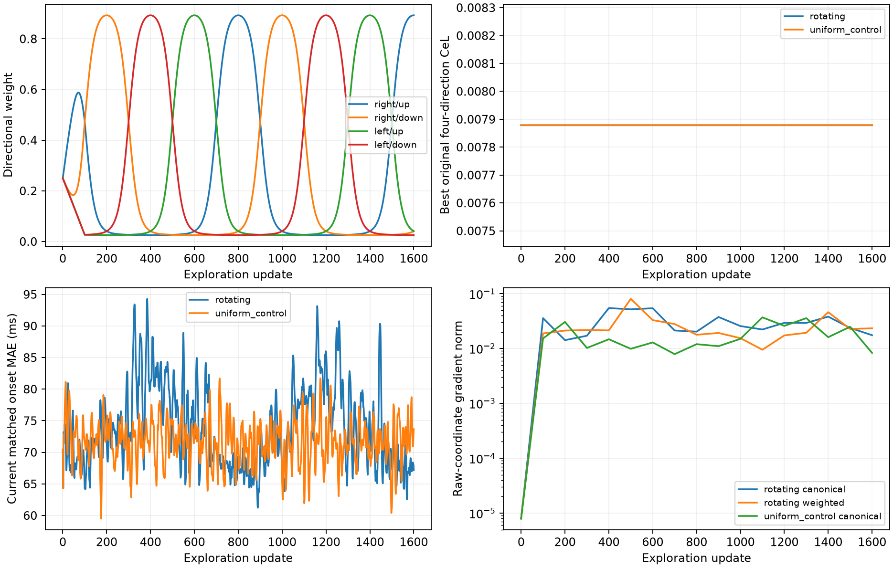

# Gradual direction rotation after a plateau

User follow-up, 2026-09-16. Begin at the known four-direction plateau from
C04-T0005; amplitudes stay fixed at 0.8 and onset logits remain independent.

At exploration update s, use L_s = sum_q w_q(s) ell_q with weights summing to 1.
Weights start uniform, then smoothly concentrate on successive corners in
clockwise order ↗ → ↘ → ↙ → ↖. Specifically, angles in implementation order
(↗,↘,↖,↙) are (0, pi/2, 3pi/2, pi), theta=2pi*s/800,
p=softmax(4*cos(theta-angle)), a=0.9*min(s/100,1), and w=(1-a)/4+a*p.
Every direction retains positive weight. Run 1600 updates (two rotations).
This is an exploratory schedule, not a schedule established by prior work.

Use fresh Adam at LR .05, betas (.9,.999), eps 1e-8; divide the objective by the
fixed original canonical loss at the restart. Do not rollback or reduce LR
while the objective changes. Keep a checkpoint only when the **original
uniform four-direction CeL** improves. Then restore that checkpoint and polish
using canonical CeL and the registered Adam/rollback schedule (max 3000 updates).

A matched control uses the identical 1600-update exploration and polish with
constant uniform weights. It separates changed weighting from extra updates or
a different plateau schedule. Neither target coordinates nor matched errors
choose checkpoints. Record weighted and canonical losses separately; record
per-direction and combined raw-coordinate gradient norms every 100 updates.
A larger gradient or a change in weighted loss alone is not escape. Check actual
pitch/onset recovery and the unchanged canonical loss.

[SCRAPL](https://arxiv.org/html/2602.11145v1), Sections 3.1–3.4, samples scattering
paths to estimate a full-loss gradient, with path-wise Adam/SAGA and an
importance-sampling heuristic. That motivates varying loss components, but
this deterministic post-plateau rotation is not an implementation of SCRAPL,
its importance sampler, or its optimiser, and is not claimed to inherit its
guarantees. Here all four terms are evaluated; there is no compute saving.

Run `python scripts/test_rotating_directions.py` with the project environment.
## Results

Both the rotating run and matched uniform control completed 1600 exploration
updates plus 248 canonical polish updates. Neither improved canonical CeL
beyond the starting **0.0078786668**. Both selected the initial checkpoint and
retained matched errors of **5.481 cents / 70.452 ms**, with the middle pitches
still swapped. The exploration allowed uphill canonical steps and did not
rollback them; checkpoint selection did not prevent exploration.

There is strong directional gradient cancellation at the starting point.
Raw-coordinate gradient norms (pitch/onset logits, unconditioned losses) are:

| Direction | Gradient norm |
|---|---:|
| right/up | 0.0186555 |
| right/down | 0.0163580 |
| left/up | 0.0144837 |
| left/down | 0.0234797 |
| equal-weight average gradient | 0.00000792007 |

These are norms of gradients, not norms of a full feature Jacobian. Individual
norms are roughly 1800–3000 times the norm of their average. This supports the
motivation to change weights when the combined gradient is weak. It does not
show that a stronger weighted gradient escapes the wrong association. Here,
rotation moves the controls but never beats the starting canonical loss.

All saved weights are positive and sum to one. Checks reproduce weighted losses
from saved directional terms and weights, and reproduce the canonical reference
as their unweighted mean (absolute tolerance 1e-12). The dominant weight peaks
at approximately 0.893. No amplitude learning or target-coordinate selection
is involved.

[Summary table](table.md), [rotation trajectory and polish](rotating.json),
[matched control](uniform_control.json), [provenance](provenance.json).
Recreate the figure with `python scripts/report_rotation.py`.

This selected case and one rotation schedule cannot settle the value of adaptive
weighting across targets, gradient-aware weighting, different cycle durations,
or other schedules. The separate [relaxed pitch-swap experiment](../README.md)
does recover the case, but adds a discrete search intervention and extra compute.

## Why the gradient monitor needs a fixed reference

With fixed nonnegative weights summing to one, the parameter gradient is
`g_w = sum_q w_q g_q`. Reweighting can expose a direction hidden by cancellation
in the uniform average. However, increasing its norm does not establish that
it moves toward the target or that the original objective improves. Our
checkpoint criterion therefore uses the unchanged canonical loss. Rotation
may temporarily increase that loss; only the stored checkpoint must improve.
This trial tests a predetermined smooth cycle, not gradient-norm-adaptive
weight selection or the full range of possible schedules.
